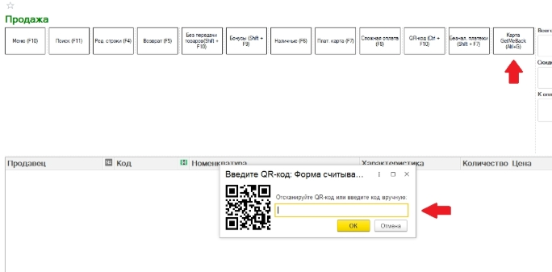
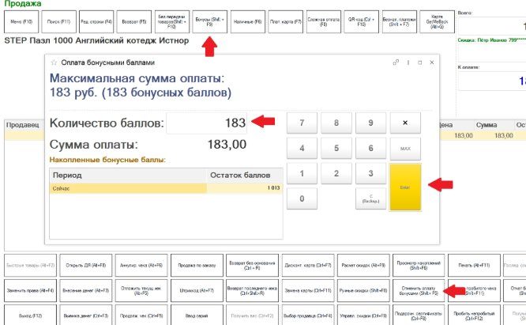

Ред. от 19.05.2022

Работа с расширением GetMeBack в чеках ККМ

После установки и настройки расширения GetMeBack в форме РМК документа «Чек ККМ» появится кнопка «**GetMeBack**».

- При нажатии на кнопку откроется форма считывания QR-кода.
- Считайте QR-код из приложения с помощью сканера или введите соответствующий код вручную и нажмите кнопку «**ОК**».

В случае успешного чтения кода на форме отобразится информация о клиенте (имя и часть номера телефона).

Если в приложении GetMeBack был выбран подарок, то, при чтении кода, он автоматически добавится в чек с ценой, соответствующей цене подарка в сервисе GetMeBack в бонусных баллах. При добавлении подарка, необходима обязательная оплата чека бонусными баллами, поэтому будут заблокированы все кнопки оплаты кроме смешанной.

Если введенный код недействителен, или при добавлении подарка у клиента не будет достаточно баллов для оплаты подарка, то появится соответствующее предупреждение.

- Для отмены ввода карты лояльности, нажмите кнопку «**Дисконт. карта**».
- При необходимости оплаты чека бонусными баллами нажмите кнопку «**Бонусы**» для открытия формы оплаты бонусными баллами. Если в чеке добавлен подарок данная форма откроется автоматически при добавлении подарка.

В открывшемся окне будет указан остаток баллов клиента и максимальная сумма оплаты бонусными баллами.

- Введите нужную сумму для оплаты бонусными баллами и нажмите кнопку «**Оплатить бонусами**».

*Примечание: если в чеке есть подарок, то оплата бонусными баллами должна быть не ниже стоимости подарка в бонусных баллах.*

- При необходимости изменения суммы оплаты бонусными баллами, нажмите кнопку «**Отменить оплату бонусами**» и повторите процедуру добавления оплаты бонусами.

При наличии в чеке подарка GetMeBack команды оплаты будут заблокированы, если не указана необходимая сумма оплаты бонусными баллами.

При пробитии чека на возврат (день в день), операция по начислению и списанию бонусов GetMeBack чека-основания отменится автоматически.
Вы можете обратиться за помощью к вашему менеджеру или по телефону +79119204699
