Инструкция по подключению 1С к GetMeBack 

Редакция от 28 июля 2025

Настоящее руководство поможет вам подключить 1С Розница 2.3 к GetMeBack. Пожалуйста следуйте инструкции, не пропускайте пункты и соблюдайте порядок действий. 

**Оглавление** 

**Шаг 1. Поиск BranchID в 1С и настройка торговой точки в GetMeBack. .............................. 2 Шаг 2. Подключение расширения конфигурации .............................................................. 6 Настройка расширения GetMeBack ................................................................................. 8 Добавление подарка GetMeBack................................................................................... 12 Шаг 3. Инструкция для кассира по работе с расширением GetMeBack в чеках ККМ ...... 14**

1) **Работа на стандартной форме: ............................................................................ 14**
1) **Работа на новой форме РМК: .............................................................................. 16**

**Шаг 1. Поиск BranchID в 1С и настройка торговой точки в GetMeBack.**

Что такое BranchID - это уникальный идентификатор торговой точки, формируемый автоматически.    

`  `**Дополнительная информация по BranchID**   

BranchID  передается  в  GetMeBack  в  составе  каждой  проведенной транзакции. Если  GetMeBack получит BranchID, который еще не привязан 

`   `ни к одной существующей торговой точке, будет создана новая торговая 

точка  в  личном  кабинете  GetMeBack,  за  которую  будет  выставлен дополнительный  счёт.  Уже  созданные  торговые  точки  и  их идентификаторы можно посмотреть в GetMeBack в разделе  Настройки - Торговые точки.   

Важно следовать инструкции и не пропускать пункты, чтобы не создать лишних торговых точек, которые будут включены в счёт вашего аккаунта GetMeBack.   

1. Откройте 1С Предприятие. Сверху справа нажмите на значок  и выберите Файл 

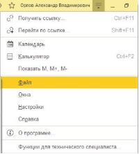

2. Нажмите Открыть… Также можно воспользоваться комбинацией на клавиатуре Ctrl+O 

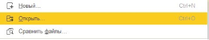

3. Найдите и выберите файл BranchID\_Finder (файл находится в архиве с расширением, можно скачать в личном кабинете, в разделе Настройки – Интеграции – 1C Розница или по[ ссылк](https://getmeback.ru/upload/integrations/1c/roznica/gmb_roznica.zip)[е) ](https://drive.google.com/u/0/uc?id=1__rsQ6cf7TsSjxWpsylkaIMB_F33Qp5U&export=download)  

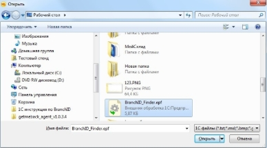

4. После открытия файла в 1С появится окно Внешней обработки, где нужно указать ссылку на объект (в данном случае объектом является склад в 1С)  

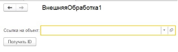

5. Нажмите на стрелку вниз и в выпадающем меню на «Показать все», откроется список всех складов, которые у вас добавлены в 1С  

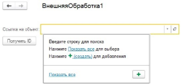

6. После нажатия кнопки «Показать все», выберите из списка свой склад в 1С, который используется, и нажмите кнопку «Выбрать» 

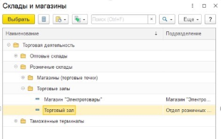

7. Теперь, когда выбрали склад, нажмите кнопку «Получить ID» и скопируйте набор символов, нажав правой кнопкой мыши по сообщению, которое появилось внизу программы   

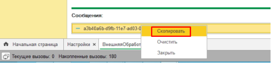

8. После успешного копирования ID вашего склада, зайдите в личный кабинет GetMeBack, откройте раздел Настройки, Торговые точки.   
1) Если торговая точка уже создана, отредактируйте её, нажав на кнопку карандаша.   
1) Если торговой точки нет, нажмите на кнопку «Добавить торговую точку»   
9. При редактировании/добавлении торговой точки найдите поле «Внешний ID \ BranchID \ IDBranch» и вставьте ID, нажав правую кнопку мыши (вставить), который был скопирован в 1С  

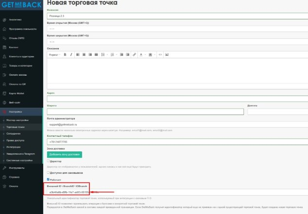

После добавления Внешнего ID, настоятельно рекомендуем заполнить все оставшиеся поля в торговой точке (если они не заполнены), и нажать на кнопку Создать/Сохранить.  Настройка торговой точки завершена, переходим к подключению расширения.   

**Шаг 2. Подключение расширения конфигурации**   

Для начала работы необходимо загрузить расширение в «1C:Предприятие». Для этого нужно открыть 1C:Предприятие с правами администратора. В «1C:Предприятие» открыть меню настроек и выбрать пункт «Функции для технического специалиста».   

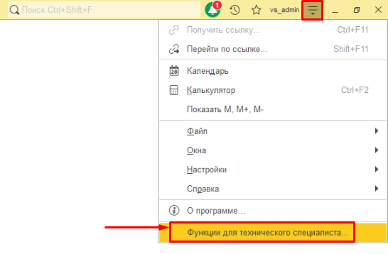

В появившемся окне выберите функцию «Управление расширениями конфигурации» (раздел «Стандартные»).   

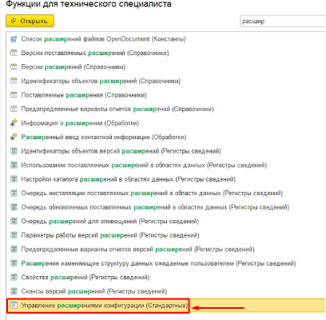

После этого откроется форма списка расширений.   

В нижней части формы в поле «Область действия при добавлении расширения конфигурации» выбрать «Информационная база».   

После этого нажать кнопку «Добавить» в верхнем левом углу и выбрать файл расширения (прим. «GetMeBackРозница.cfe»).   

**Важно: Перед добавлением расширения необходимо закрыть все другие активные сеансы!** После этого расширение появится в списке. Далее для данного расширения необходимо отключить  пункты:  «Безопасный  режим,  имя  профиля»,  «Защита  от  опасных  действий», «Использовать основные роли для всех пользователей».   

Для применения загруженного расширения необходимо перезапустить «1C:Предприятие».   

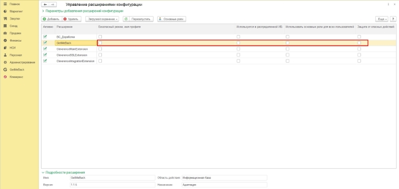

**Настройка расширения GetMeBack**   

После установки расширения у пользователей с правами администратора появится новый раздел «GetMeBack». В данном разделе выбираем «Мастер настройки».   

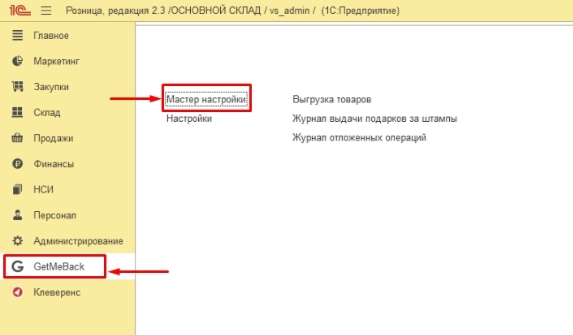

В окне «Мастер настройки» необходимо ввести:   

**Ключ API** – Уникальный идентификатор для подключения к сервису GetMeBack.   **Адрес сервиса** – [domain].getmeback.ru/rest/base/v33/validator, где [domain] - домен клиента в системе GetMeBack.  

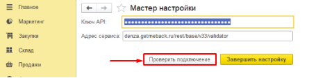

` `После заполнения настроек нажать кнопку «Проверить подключение», если появилось сообщение «Подключение установлено, нажмите кнопку «Завершить настройку». 

*Журнал отложенных операций – В этом журнале хранятся данные по операциям, которые вовремя не были отправлены в GetMeBack.* 

*Журнал выдачи подарков за штампы хранит историю выданных подарков, если при настройке была выбрано «Создавать оприходование товара»* 

Откройте следующий раздел в GetMeBack – Настройки

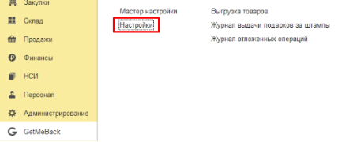

Нажмите по очереди 1 раз на кнопки: «Настроить по умолчанию», «Настроить скидку» и «Сохранить» 

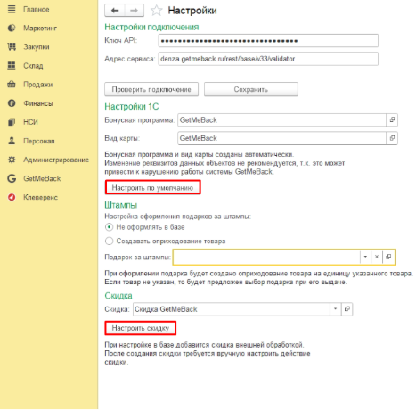

*Если вы планируете использовать подарки за штампы, например, 5й кофе в подарок, есть 2 сценария:*  

1) *Не оформлять в базе (При накоплении максимального количества штампов на форме РМК будет кнопка «Выдать подарок», при нажатии на кнопку кассир выдаёт клиенту подарок, обнуляются штампы, в GetMeBack отображается информация, что клиенту был выдан подарок)* 
1) *Создавать оприходование товара (Необходимо в 1С добавить подарок или группу подарков, которые будут выдаваться по кнопке на форме РМК «Подарок GetMeBack», в Журнале выдачи подарков за штампы будет вестись учёт выданных подарков).* 

Для работы расширения необходимо использование типового механизма бонусных баллов 1С.*   Откройте раздел **«Администрирование»** и в появившемся окне раскройте раздел   **«Маркетинг»**.   

В данном разделе должны быть включена следующая функциональная опция: 

**«Бонусные программы лояльности».**   

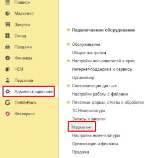 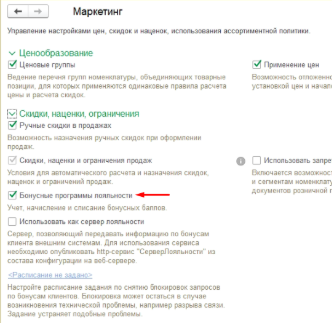

Для передачи номенклатуры из 1С в GetMeBack на форме GetMeBack откройте раздел Выгрузка товаров и нажмите на кнопку «Выгрузить товары» 

**Если у вас тариф с мобильным приложением, то рекомендуется после выгрузки товаров нажать на кнопку «Выгрузить изображения товаров» (если настроены) и включить обмен остатками.** 

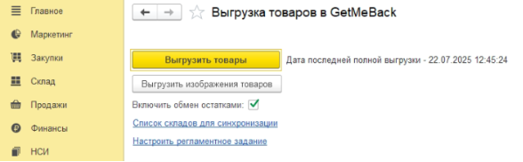

После того, как остатки из 1С будут выгружены в GetMeBack, в личном кабинете, в разделе Онлайн заказы – Настройки нужно включить функцию контроля остатков 

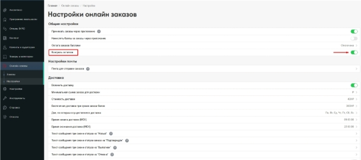

Пример отображения остатков в карточке товара GetMeBack: 

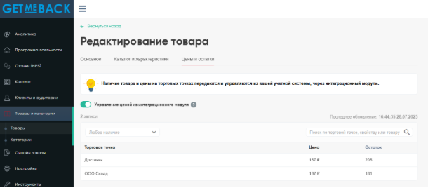

**Добавление подарка GetMeBack**   

При необходимости добавления подарков в чек, предварительно требуется сопоставить идентификаторы подарков в базе 1С и системе GetMeBack.   

Для подарков в базе 1С рекомендуется создавать отдельную номенклатуру без характеристик.   

В качестве идентификатора в базе 1С используется код номенклатуры. Откройте карточку номенклатуры-подарка и скопируйте код.   

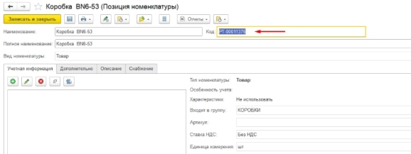

Откройте панель управления GetMeBack.   

В панели управления откройте раздел «Программа лояльности» -> «Подарки за баллы». В данном разделе выберите нужный подарок и нажмите кнопку редактирования.   

В окне выбранного подарка, в нижней части, найдите поле «Внешний ID».   В данное поле вставьте код соответствующей номенклатуры 1С. 

Нажмите кнопку «Сохранить».   

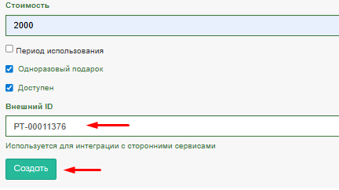

После этого при чтении в чеке ККМ кода с подарком, выбранный подарок автоматически добавиться в список товаров.   

**Шаг 3. Инструкция для кассира по работе с расширением GetMeBack в чеках ККМ**   

После установки и настройки расширения GetMeBack в форме РМК документа «Чек ККМ» появится кнопка «GetMeBack». 

Расширение GetMeBack позволяет работать на стандартной и новой формах РМК: 

1) Работа на стандартной форме: 
- При нажатии на кнопку откроется форма считывания QR-кода.   
- Считайте QR-код из приложения с помощью сканера или введите соответствующий код вручную и нажмите кнопку «ОК».   

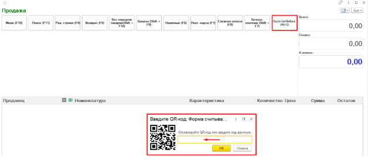

В случае успешного чтения кода на форме отобразится информация о клиенте (имя и часть номера телефона).   Когда у клиента накоплено максимальное количество штампов для получения подарка, также появится кнопка «Выдача подарка GetMeBack» 

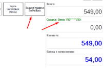

Если в приложении GetMeBack был выбран подарок, то, при чтении кода, он автоматически добавится в чек с ценой, соответствующей цене подарка в сервисе GetMeBack в бонусных баллах.   

При добавлении подарка, необходима обязательная оплата чека бонусными баллами, поэтому будут заблокированы все кнопки оплаты кроме смешанной.   

Если введенный код недействителен, или при добавлении подарка у клиента не будет достаточно баллов для оплаты подарка, то появится соответствующее предупреждение.   

- Для отмены ввода карты лояльности, нажмите кнопку «Д**исконт. карта**».   
- При необходимости оплаты чека бонусными баллами нажмите кнопку «Бонусы» для открытия формы оплаты бонусными баллами. Если в чеке добавлен подарок данная форма откроется автоматически при добавлении подарка.   

В открывшемся окне будет указан остаток баллов клиента и максимальная сумма оплаты бонусными баллами.   

- Введите нужную сумму для оплаты бонусными баллами и нажмите кнопку «**Оплатить бонусами**».    

*Примечание: Если в чеке есть подарок, то оплата бонусными баллами должна быть не ниже стоимости подарка в бонусных баллах.*    

- При необходимости изменения суммы оплаты бонусными баллами, нажмите кнопку «**Отменить оплату бонусами**» и повторите процедуру добавления оплаты бонусами.   

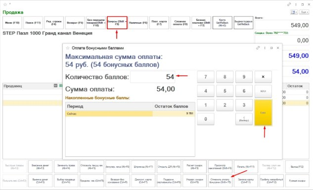

- При наличии в чеке подарка GetMeBack команды оплаты будут заблокированы, если не указана необходимая сумма оплаты бонусными баллами.   
- При пробитии чека на возврат (День в день), операция по начислению и списанию бонусов GetMeBack чека-основания отменится автоматически.   
2) Работа на новой форме РМК: 

Для включения новой формы РМК откройте в 1С раздел Администрирование – Продажи 

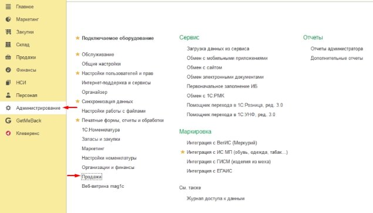

Поставьте галочку «Использовать новое РМК» 

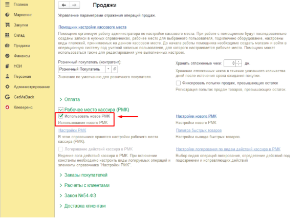Откройте Настройки нового РМК, найдите раздел «Виды оплат» и поставьте галочку «Использовать бонусы» 

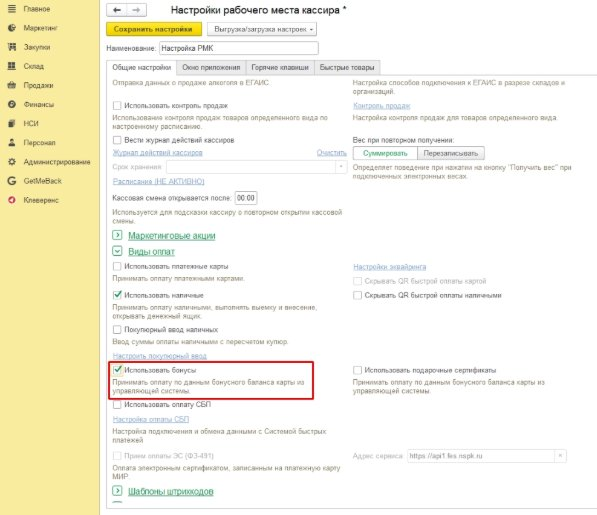

Принцип работы с бонусами от стандартной формы немного отличается, для добавления гостя в заказ нажмите кнопку «Данные покупателя» - «GetMeBack» и отсканируйте или введите код вручную карты лояльности. 

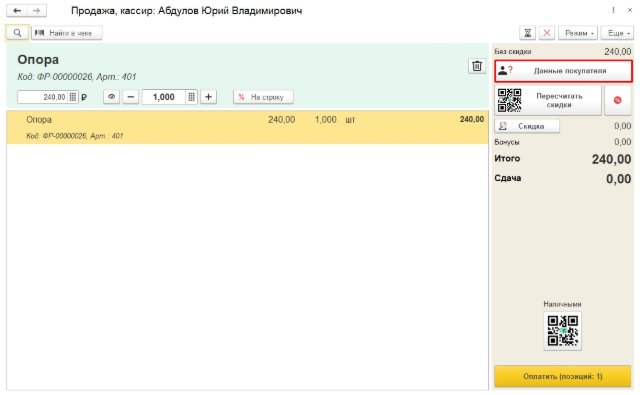

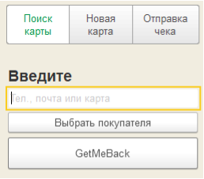 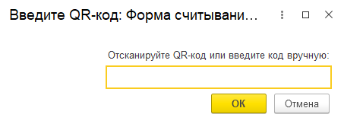

В случае успешного чтения кода на форме отобразится информация о клиенте (имя, номер телефона, количество бонусов, сколько получит клиент с покупки и сколько можно списать бонусов на текущий чек).   Когда у клиента накоплено максимальное количество штампов для получения подарка, также появится кнопка «Подарок GetMeBack» 

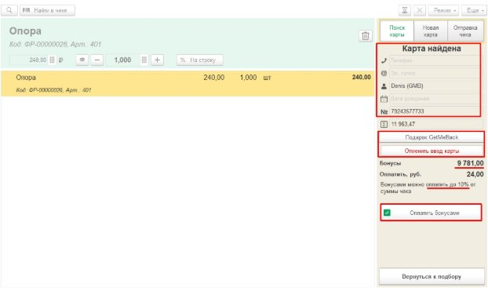

Чтобы удалить карту гостя, нажмите кнопку «Отменить ввод карты» 

Для списания бонусов нажмите на кнопку «Оплатить бонусами», если клиент решил не списывать, то проведите оплату удобным для клиента способом, наличными либо картой. При списании баллов информация будет отображена в составе чека 

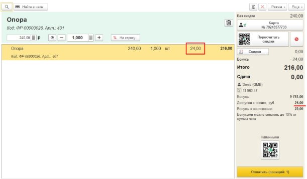
Тех. Поддержка с 8:00 до 20:00 по МСК по рабочим дням 

+7 (812) 407-27-85 WhatsApp или телефон, телеграм @getmeback\_support, support@getmeback.ru 
