Редакция №1 от 11.07.2024

**Настройка интеграции GetMeBack c 1С:УНФ** 

Настоящее руководство поможет вам подключить 1С УНФ 3.0, а также Розница 3.0 к GetMeBack. Пожалуйста, следуйте инструкции, не пропускайте пункты и соблюдайте порядок действий.  

**Оглавление** 

Шаг 1. Поиск BranchID в 1С и настройка торговой точки в GetMeBack.. 2 Шаг 2. Подключение расширения конфигурации .......................................... 6 Шаг 3. Настройка расширения GetMeBack ..................................................... 8 

Шаг 4. Инструкция для кассира по работе с расширением GetMeBack  на форме РМК. ..................................................................................... 10 

С технической поддержкой GetMeBack можно связаться в будние дни с 8:00 до 20:00 (МСК):

- по телефону +7 (812) 407-27-85 (позвонить/написать в WhatsApp)    
- в Telegram-чате @getmeback\_support  ![ref1]
- отправить письмо на почту support@getmeback.ru 

**Шаг 1. Поиск BranchID в 1С и настройка торговой** 

**точки в GetMeBack** 

Что такое BranchID – это уникальный идентификатор торговой точки, формируемый автоматически.    

**Дополнительная информация о BranchID **

BranchID передается в GetMeBack в составе каждой проведенной транзакции.      Если GetMeBack получит BranchID, который еще не привязан ни к одной \
существующей торговой точке, будет создана новая торговая точка в личном       кабинете GetMeBack, за которую будет выставлен дополнительный счёт. Уже       созданные торговые точки и их идентификаторы можно посмотреть в GetMeBack в разделе  «**Настройки – Торговые точки»**. 

Важно следовать инструкции и не пропускать пункты, чтобы не создать лишних торговых точек, которые будут включены в счёт вашего аккаунта GetMeBack.   

1. Откройте 1С Предприятие. Сверху справа нажмите на значок   и выберите «Файл» 

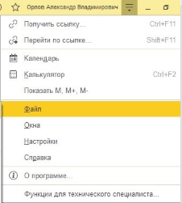

2. Нажмите «Открыть». Также можно воспользоваться комбинацией на клавиатуре Ctrl+O 

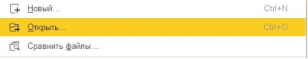

3. Найдите и выберите файл BranchID finder (Розница 3.0, УНФ) (файл находится в архиве, можно скачать здесь>>>)

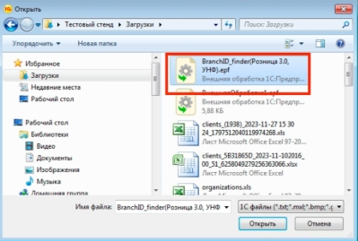

4. После открытия файла в 1С появится окно Внешней обработки, где нужно указать ссылку на объект (в данном случае объектом является склад в 1С)

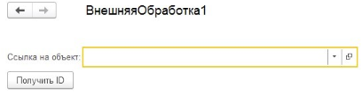

5. Нажмите на стрелку вниз и в выпадающем меню на «Показать все» 

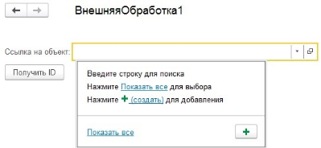

6. После нажатия кнопки «Показать все», найдите из списка свой склад в 1С, который используется, и нажмите кнопку «Выбрать»

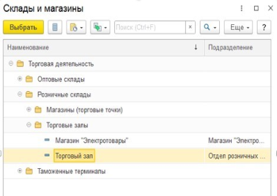

7. Теперь, когда выбрали склад, нажмите кнопку «Получить ID» и скопируйте набор символов, нажав правой кнопкой мыши по сообщению, которое появилось внизу программы 

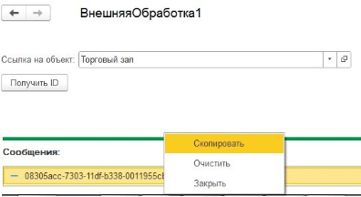

8. После успешного копирования ID вашего склада, зайдите в личный кабинет GetMeBack, откройте раздел «Настройки – Торговые точки».   
1) Если торговая точка уже создана, отредактируйте её, нажав на кнопку карандаша.  
1) Если торговой точки нет, нажмите на кнопку «Добавить торговую точку». 
9. При редактировании/добавлении торговой точки найдите поле «Внешний ID / BranchID / IDBranch» и вставьте ID, который был скопирован из 1С, нажав правую кнопку мыши (вставить). 

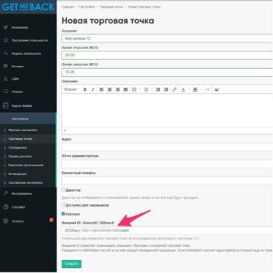

После добавления Внешнего ID, настоятельно рекомендуем заполнить все оставшиеся поля в торговой точке (если они не заполнены), и нажать на кнопку «Создать/Сохранить».   

Настройка торговой точки завершена, переходим к подключению расширения.   

**Шаг 2. Подключение расширения конфигурации** 

Для начала работы необходимо загрузить расширение в «1C:Предприятие». Для этого нужно открыть «1C:Предприятие» с правами администратора. В «1C:Предприятие» открыть «Настройки» в боковом меню и нажать на «Печатные формы, отчеты и обработки»

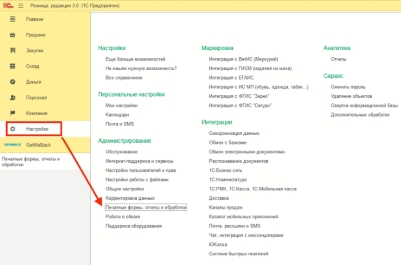

В появившемся окне откройте раздел «Расширения».   

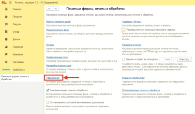

На форме расширений нажмите на кнопку «Добавить из файла». 

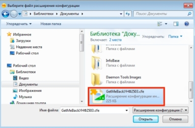

Выберите файл интеграции GetMeBackУНФ2503.cfe и нажмите «Открыть». 

**Важно! Перед добавлением расширения необходимо закрыть все другие активные сеансы!**  

После  этого  расширение  появится  в  списке.  Далее  для  данного расширения необходимо отключить пункт «Безопасный режим».  

Для применения загруженного расширения необходимо перезапустить «1C:Предприятие».   

**Шаг 3. Настройка расширения GetMeBack** 

После установки расширения у пользователей с правами администратора появится новый раздел «GetMeBack». В данном разделе выберите «Мастер настройки».  

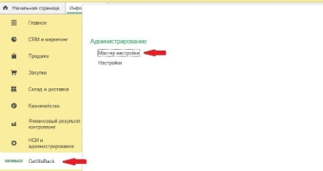

В окне «Мастер настройки» необходимо ввести:  

**Адрес сервиса** – [domain].getmeback.ru/rest/base/v33/validator, где [domain] - домен клиента в системе GetMeBack.   

**Ключ API** – Уникальный идентификатор для подключения к сервису GetMeBack.   

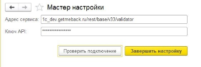

После заполнения настроек нажать кнопку «Проверить подключение».   

После успешной проверки подключения к сервису нажать кнопку «Завершить настройку» для сохранения настроек и автоматического создания элементов базы 1С для работы сервиса.  

Также для работы расширения необходимо использование типового механизма бонусных баллов 1С.  

Откройте раздел **«Настройки»** и в появившемся окне откройте раздел **«Поддержка оборудования»**.   

В данном разделе нажмите на **«Настройки РМК».** 

В появившемся окне раскройте вкладку «Виды оплат» и поставьте галочку «Использовать бонусы».

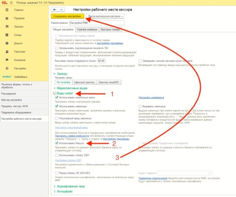

**Шаг 4. Инструкция для кассира по работе с** 

**расширением GetMeBack на форме РМК** 

1. Откройте раздел Продажи, Рабочее место кассира (РМК). Авторизуйтесь под своим логином и паролем.

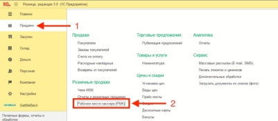

2. Отсканируйте товар сканером или найдите его через поиск в каталоге. 

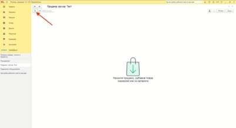

3. После добавления товаров, нажмите на кнопку «Данные покупателя» и «GetMeBack». 

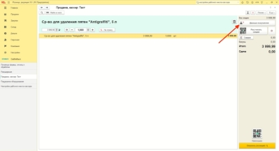

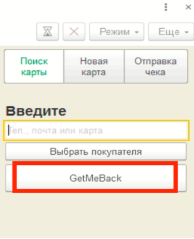

4. Отсканируйте карту лояльности клиента или введите код вручную. 

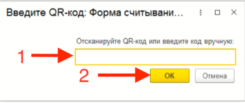

5. После поиска клиента появится его сумма бонусов и бонусов, которые доступны к оплате. При нажатии на кнопку «Оплатить бонусами» спишутся все бонусы, которые доступны к оплате.

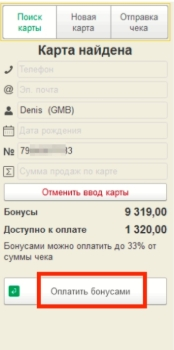

6. Если нужно списать определенное количество бонусов, то нажмите на кнопку «Вернуться к продаже».
6. Укажите количество бонусов, которые нужно списать.

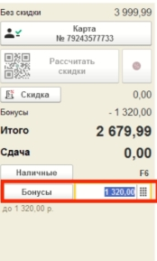

8. Оставшуюся сумму нужно пробить наличными или картой. После этого нажать на кнопку «Пробить чек». 

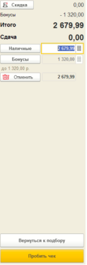

9. После пробития чека операция о продаже будет отправлена в GetMeBack. 
14 ![ref1]

[ref1]: Aspose.Words.b456c59b-a598-408a-bbf3-e31234d05790.001.png
