**Инструкция по подключению 1С к GetMeBack**   

Редакция от 18 июня 2025   

Настоящее руководство поможет вам подключить 1С УТ 11.5 к GetMeBack. Пожалуйста следуйте инструкции, не пропускайте пункты и соблюдайте порядок действий.   

Оглавление 

[**Шаг 1. Поиск BranchID в 1С.** ................................................................................................................... 1 ](#_page0_x51.00_y317.92)[**Шаг 2. Подключение расширения конфигурации** .............................................................................. 5 ](#_page4_x51.00_y56.92)[Настройка расширения GetMeBack ........................................................................................................ 7 ](#_page5_x51.00_y510.92)[**Шаг 3. Инструкция для кассира по работе с расширением GetMeBack в чеках ККМ.** ............... 9](#_page8_x51.00_y56.92)

**Шаг 1. Поиск BranchID в 1С.**   

Что такое **BranchID** - это уникальный идентификатор торговой точки, формируемый автоматически.     

`  `**Дополнительная информация по BranchID**   

BranchID  передается  в  GetMeBack  в  составе  каждой  проведенной транзакции.  Если   GetMeBack  получит  BranchID,  который  еще  не 

`   `привязан ни к одной существующей торговой точке, будет создана новая 

торговая  точка  в  личном  кабинете  GetMeBack,  за  которую  будет выставлен дополнительный счёт. Уже созданные торговые точки и их идентификаторы можно посмотреть в GetMeBack в разделе  Настройки - Торговые точки.   

Важно следовать инструкции и не пропускать пункты, чтобы не создать лишних торговых точек, которые будут включены в счёт вашего аккаунта GetMeBack.   

1. Откройте 1С Предприятие. Сверху справа нажмите на значок  и выберите Файл 

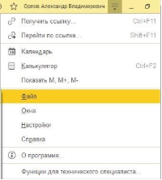

2. Нажмите «Открыть…» Также можно воспользоваться комбинацией на клавиатуре Ctrl+O

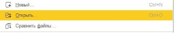

3. Найдите и выберите файл BranchID\_Finder (файл находится в архиве, можно скачать[ тут)](https://getmeback.ru/upload/integrations/1c/ut/gmb_1c_ut.zip) 

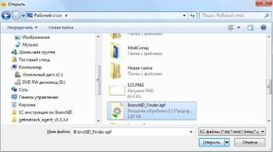

4. После открытия файла в 1С появится окно Внешней обработки, где нужно указать ссылку на объект (в данном случае объектом является склад в 1С)  

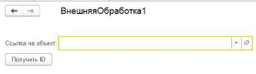

5. Нажмите на стрелку вниз и в выпадающем меню на «Показать все» 

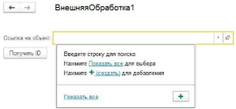

6. После нажатия кнопки «Показать все», найдите из списка свой склад в 1С, который используется, и нажмите кнопку «Выбрать» 

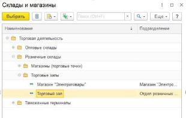

7. Теперь, когда выбрали склад, нажмите кнопку «Получить ID» и скопируйте набор символов, нажав правой кнопкой мыши по сообщению, которое появилось внизу программы 

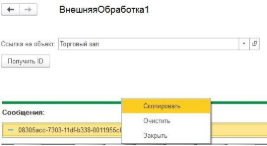

8. После успешного копирования ID вашего склада, зайдите в личный кабинет GetMeBack, откройте раздел Настройки, Торговые точки.   
1) Если торговая точка уже создана, отредактируйте её, нажав на кнопку карандаша.   
1) Если торговой точки нет, нажмите на кнопку «Добавить торговую точку»   
9. При редактировании/добавлении торговой точки найдите поле «Внешний ID \ BranchID \ IDBranch» и вставьте ID, нажав правую кнопку мыши (вставить), который был скопирован в 1С 

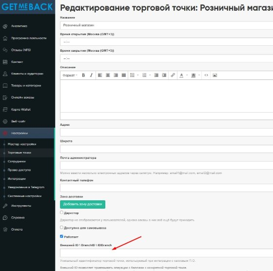

После добавления Внешнего ID, настоятельно рекомендуем заполнить все оставшиеся поля в торговой точке (если они не заполнены), и нажать на кнопку Создать/Сохранить.  Настройка торговой точки завершена, переходим к подключению расширения.   

**Шаг 2. Подключение расширения конфигурации**    

Для начала работы необходимо загрузить расширение в 1C:Предприятие.    Для этого нужно открыть 1C:Предприятие с правами администратора. В 1С   

1C:Предприятие открыть меню настроек и выбрать пункт «Функции для технического специалиста».    

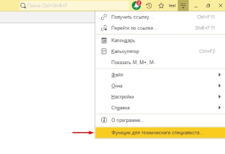

В появившемся окне выберите и нажмите «Открыть» функцию «Управление расширениями конфигурации» (Раздел «Стандартные»).    

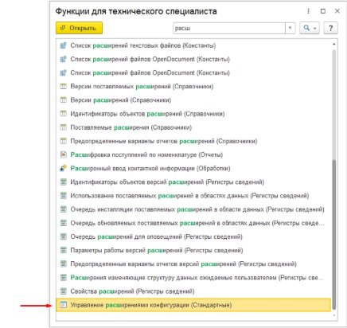

После этого откроется форма списка расширений.    

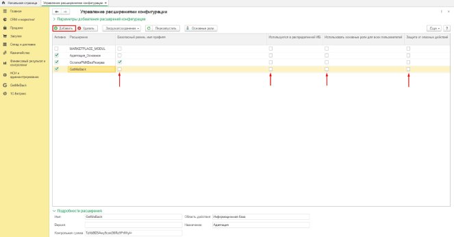

В нижней части формы в поле «Область действия при добавлении расширения конфигурации» выбрать «Информационная база».    

После этого нажать кнопку «Добавить» в верхнем левом углу и выбрать файл расширения (Прим. «GetMeBack.cfe»).    

**Перед добавлением расширения необходимо закрыть все другие активные сеансы.**   После этого расширение появится в списке.    

Далее для данного расширения необходимо отключить пункты: «Безопасный режим, имя профиля», «Защита от опасных действий», «Использовать основные роли для всех пользователей».    

Для применения загруженного расширения необходимо перезапустить 1С:Предприятие.    

**Настройка расширения GetMeBack**    

После установки расширения у пользователей с правами администратора появится новый раздел «GetMeBack». В данном разделе выберите «Мастер настройки».    

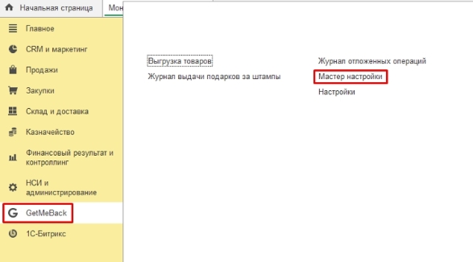

В окне «Мастер настройки» необходимо ввести:    

**Адрес сервиса** – [domain].getmeback.ru/rest/base/v33/validator , где [domain] - домен клиента в системе GetMeBack.    

**Ключ API** – Уникальный идентификатор для подключения к сервису GetMeBack.    

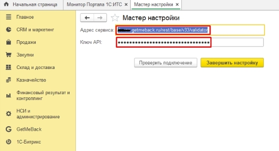

После заполнения настроек нажать кнопку «Проверить подключение».    

После успешной проверки подключения к сервису нажать кнопку «Завершить настройку» для сохранения настроек и автоматического создания элементов базы 1С для работы сервиса.    

Для передачи номенклатуры из 1С в GetMeBack на форме GetMeBack откройте раздел Выгрузка товаров и нажмите на кнопку «Выгрузить товары» 

Если у вас тариф с мобильным приложением, то рекомендуется после выгрузки товаров нажать на кнопку «Выгрузить изображения товаров» и включить обмен остатками. 

Также для работы расширения необходимо использование типового механизма бонусных баллов 1С.     

`    `Откройте раздел **«НСИ и администрирование» - «Настройка НСИ и разделов» - «CRM и маркетинг»** и в появившемся окне раскройте раздел **«Маркетинг»**. В данном разделе должны быть включены следующие функциональные опции: **«Автоматические скидки в продажах», «Бонусные программы», «Карты лояльности»**.    

**Шаг 3. Инструкция для кассира по работе с расширением GetMeBack в чеках ККМ.**

После установки и настройки расширения GetMeBack в форме РМК документа «Чек ККМ» появится кнопка «GetMeBack».    

При нажатии на кнопку откроется форма считывания QR-кода.     

Считайте QR-код лояльности клиента с помощью сканера или введите соответствующий код вручную и нажмите кнопку «ОК».    

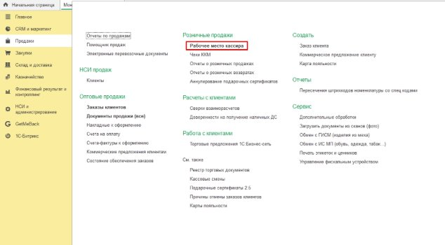

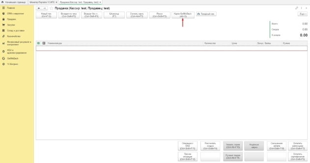

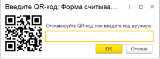

В случае успешного чтения кода на форме отобразится информация о клиенте (Имя и часть номера телефона).  

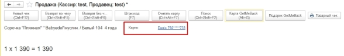

Если в приложении GetMeBack был выбран подарок, то, при чтении кода, он автоматически добавится в чек с ценой, соответствующей цене подарка в сервисе GetMeBack в бонусных баллах.     

При добавлении подарка, необходима обязательная оплата чека бонусными баллами, поэтому будут заблокированы все кнопки оплаты кроме смешанной.     

Если введенный код недействителен, или при добавлении подарка у клиента не будет достаточно баллов для оплаты подарка, то появится соответствующее предупреждение.  При необходимости оплаты чека бонусными баллами на форме «Смешанная оплата» 

нажмите кнопку «Оплатить бонусными баллами» для открытия формы оплаты бонусными баллами. 

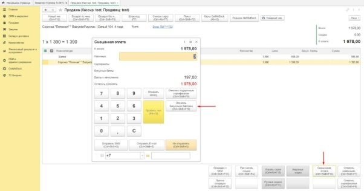

Если в чеке добавлен подарок данная форма откроется автоматически. В открывшемся окне будет указан остаток баллов клиента и максимальная сумма оплаты бонусными баллами.    

Введите нужную сумму для оплаты бонусными баллами и нажмите кнопку «Оплатить баллами». Если в чеке есть подарок, то оплата бонусными баллами должна быть не ниже стоимости подарка в бонусных баллах.    

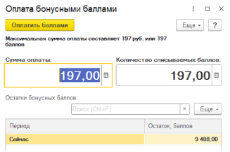

После нажатия на кнопку «Оплатить баллами», на форме смешанной оплаты появится оплата бонусными баллами. После ввода нужной суммы оплаты пробейте чек.    

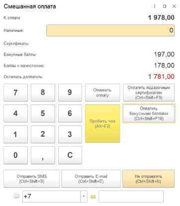

После проведения оплаты кассиру будет выведено сообщение о начислении баллов клиенту.  

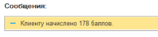

Для оформления возврата на форме РМК нажмите на кнопку «Возврат по чеку», выберите чек для возврата и нажмите на кнопку «Оформить возврат» 

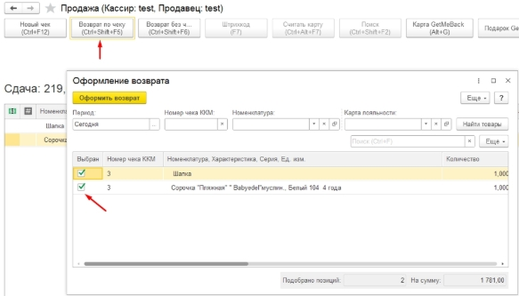

При оформлении возврата в 1С информация будет передана вGetMeBack и автоматически будет отменена текущая операция по возврату. 

Готово! Можно совершать покупки в 1С и отслеживать статистику нашей торговой точки в разделе Аналитика, Активность торговых точек.    
Тех. Поддержка с 8:00 до 20:00 по МСК по рабочим дням 

+7  (812)  407-27-85  WhatsApp  или 

телефон, телеграм @getmeback\_support, support@getmeback.ru 
