1. Создание сотрудника

   Для синхронизации товаров через CommerceML необходимо создать

специального пользователя, с ограниченными правами доступов, для этого Перейдите в Настройки->Сотрудники. Внизу страницы будет форма создания сотрудника.

При добавлении обязательно поставьте галочку “Доступ в админ панель”

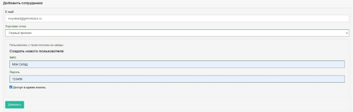

Запомните email и пароль, он понадобится при настройке МоегоСклада

2. Создание группы

Перейдите в Настройки -> Права доступа и нажмите на кнопку “Создание группы пользователя”, создайте группу с произвольным названием (например “МойСклад”)

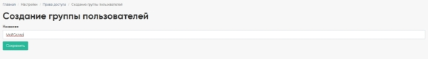

После создания нажмите кнопку “Права доступа группы”, потом “Редактировать”

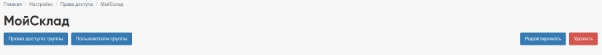

Установите флажок “Импорт CommerceML” в группе “Интеграции”

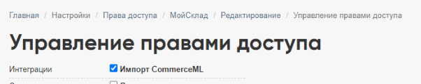

И нажмите сохранить внизу страницы

Возвращаемся в права доступа созданной группы ( Настройки -> Права доступа -> МойСклад ), нажимаем на кнопку “Пользователи группы”, далее “Редактировать”

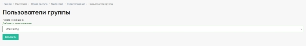

В выпадающем списке выбираем созданного в п1. пользователя и жмем “Добавить”

3. Настройка интеграции в МоемСкладе

В правом верхнем углу нажимаем на профиль пользователя и в выпадающем меню выбираем “Настройки”

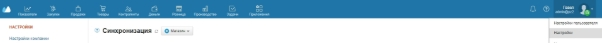

На странице настроек переходим в “Обмен данными” -> “Интернет-магазины”, нажимем кнопку “+ Магазин” и в выпадающем меню выбираем “Обмен по CommerceML”

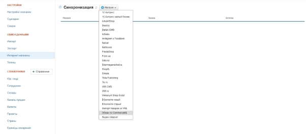

Настройка соединения

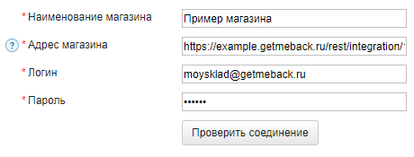

В поле наименование магазина указываем произвольное название

Адрес магазина https://<ВАШ\_ДОМЕН>.getmeback.ru/rest/integration/1c\_exchange.php В качестве логин/пароля указываем email и пароль сотрудника созданного в п1.

Если все верно настроено, то после нажатия на кнопку “Проверить соединение” должно появится уведомление “Соединение прошло успешно”

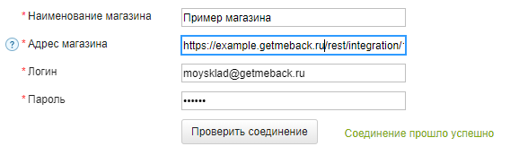

Настройки параметров интеграции

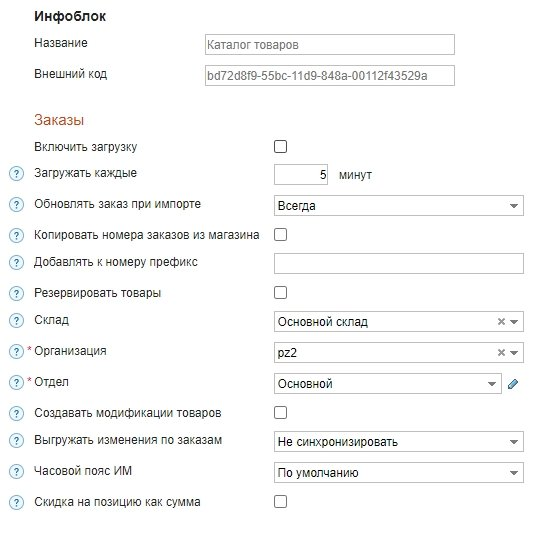

Убираем флажок Заказы - Включить выгрузку

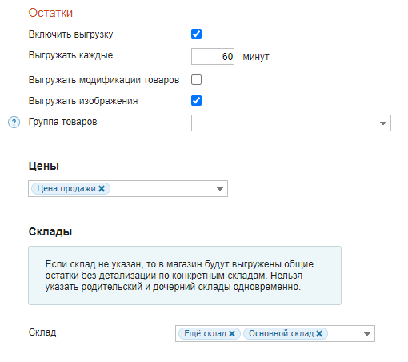

Выгрузка остатков:

Включить выгрузку - да

Выгружать каждые - не менее чем 60 мину

Выгружать модификации - нет (не поддерживается в данный момент, возможны ошибки при включенной опции)

Выгружать изображения - опционально, включите если хотите выгружать изображения из МоегоСклада - в этом случае вы не сможете загружать изображения товаров через админку GetMeBack - т.к. при последующих синхронизациях изображения перезатрутся.

Группа товаров - опционально укажите если необходимо выгружать не все товары. Цены - Выбираем нужную цену для выгрузки. Несколько цен не поддерживается. Склад - выберите склады по которым необходимо выгружать остатки.

Как получить ID корневой категории в МоемСкладе

Корневая категория - это категория у которой не заполнено свойство “Группа”. Если необходимо выгружать не весь каталог, то укажите в настройках “Ид корневой

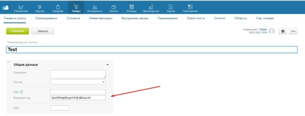

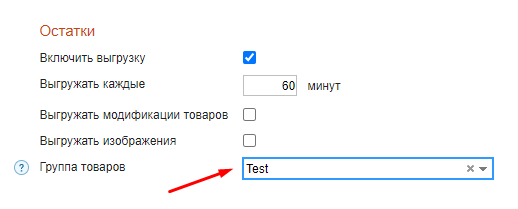
Вы можете обратиться за помощью к вашему менеджеру

или по телефону +79119204699
