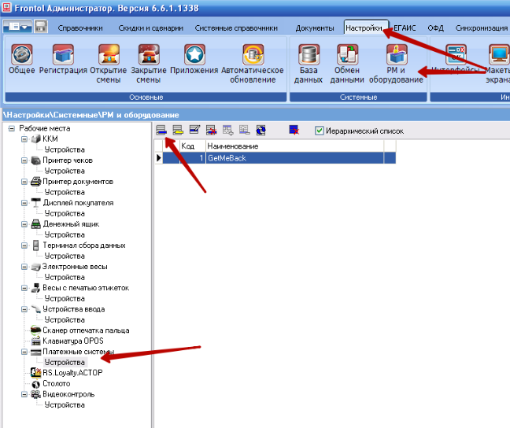
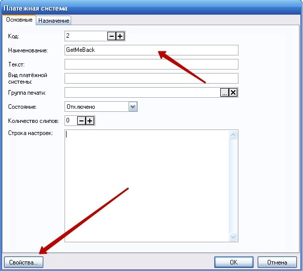
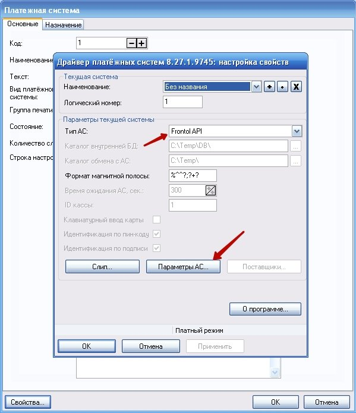
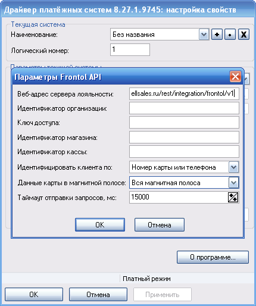
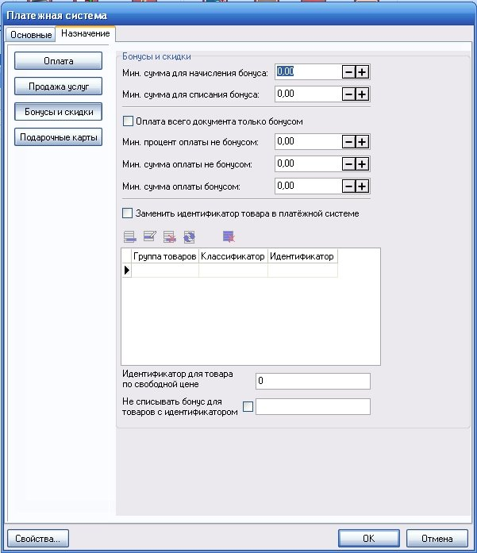
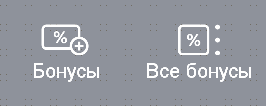
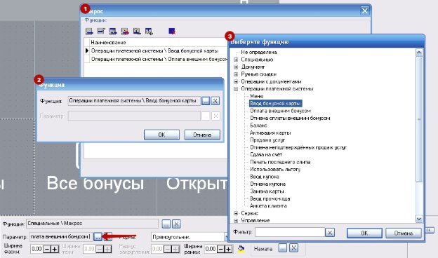
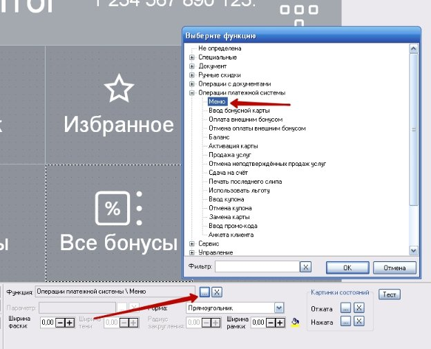

Frontol - GetMeBack

Редакция от 28 февраля 2020

Подключение платежного устройства

GetMeBack подключается к Frontol как внешняя платежная система.

Для начала работы необходимо добавить новое платежное устройство.

Для этого нужно в программе Frontol Администратор в разделе Настройки - РМ и Оборудование - Платёжные системы - Устройства создать новое устройство.

В появившемся окне необходимо ввести наименование платежной системы, например GetMeBack, по необходимости выбрать группу печати и заполнить остальные поля. Далее необходимо перейти в Свойства создаваемой платёжной системы

В появившемся окне необходимо выбрать Тип АС “Frontol API” и перейти Раздел параметры АС.

В окне “Параметры АС” необходимо ввести:

**Веб-адрес сервера лояльности** - http://[domain].getmeback.ru/rest/integration/frontol/v1 где [domain] - домен клиента в системе GetMeBack.

**Идентификатор организации** - Название организации.

**Ключ доступа** - Уникальный идентификатор организации, получается у персонального менеджера.

**Идентификатор магазина** - Признак магазина. Для привязки кассы в системе GetMeBack Идентификатор магазина должен совпадать с полем “Внешний ID” в настройках филиалов в системе GetMeBack. Если не указать GMB не сможет привязать операцию к заведению. **Идентификатор кассы -** признак или порядковый номер кассы

**Таймаут отправки запросов -** Рекомендуемое значение не менее 15000 мс

В разделе “Платёжная система” на вкладке “Назначение” Необходимо активировать пункт “Бонусы и скидки”

Остальные поля раздела настраиваются на усмотрение организации.

Интерфейс Frontol

В интерфейсе фронтол должны быть добавлены кнопки для работы с внешними системами, например

Со следующими свойствами:

**Бонусы - Вызов окна ввода бонусной карты**

Функциия: Специальные \ Макрос

Параметр: Ввод бонусной карты | Оплата внешним бонусом |

**Все бонусы - Вызов окна работы с внешними бонусными системами** Функция: Операции платежной системы \ меню

**Подробную информацию о настройке интерфейсов можно найти в Руководстве администратора - Группа “Интерфейсы”**
Вы можете обратиться за помощью к вашему менеджеру или по телефону +79119204699
