Редакция №2 от 21.02.2025 

**Настройка iikoDelivery** 

**Содержание инструкции** 

Шаг 1. Создание услуги «Доставка GetMeBack» ......................................................... 1 Шаг 2. Выгрузка меню .................................................................................................... 3 Шаг 3. Создание типа оплаты «Бонусы GetMeBack» .................................................. 4 Шаг 4. Создание типа оплаты «Банковская карта из приложения» ........................... 5 Шаг 5. Настройка Cloud API .......................................................................................... 6 Шаг 6. Подключение iikoDelivery в личном кабинете GetMeBack ............................... 8 Шаг 7. Выбор терминала в торговой точке в личном кабинете GetMeBack .............. 9 Шаг 8. Сопоставление товаров в личном кабинете GetMeBack ............................... 10 

**Шаг 1. Создание услуги «Доставка GetMeBack»** 

1. Откройте iikoFront. 
1. Перейдите во вкладку «Финансы - Услуги». 
1. Добавьте новую категорию «Услуги», если ее нет. 

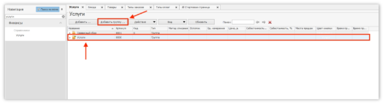

4. Нажмите на кнопку «Добавить». 

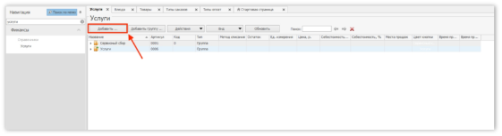

![ref1]

5. Заполните поля так, как написано ниже, и сохраните настройки: 
- Название – Доставка GetMeBack 
- Тип номенклатуры – Услуга 
- Бухгалтерская категория – Товар 
- Родительская категория  – Услуги 
- Место приготовления – На усмотрение бизнеса 
- Время приготовления по умолчанию – галочка активна 
- Свободная цена – галочка активна 

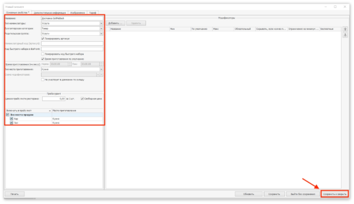![ref1]

**Шаг 2. Выгрузка меню** 

1. Откройте iikoOffice. 
1. Выберите раздел «Oбмен данными – Выгрузка меню». 
1. Выберите папки/товары/услуги, которые планируете добавить во внешнее 

меню. 

4. Нажмите «Добавить выбранные товары». 

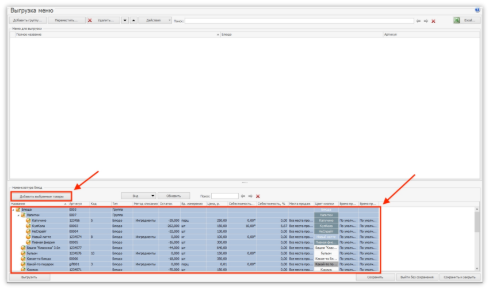

5. Убедитесь, что вы добавили все товары, которые должны быть в каталоге 

приложения от GetMeBack, в том числе услугу «Доставка GetMeBack». 

6. Нажмите «Сохранить». 

   **Шаг 3. Создание типа оплаты «Бонусы GetMeBack»** 

1. Откройте iikoOffice. 
1. Перейдите в раздел «Розничные продажи – Типы оплат». 
1. Нажмите кнопку «Добавить». 

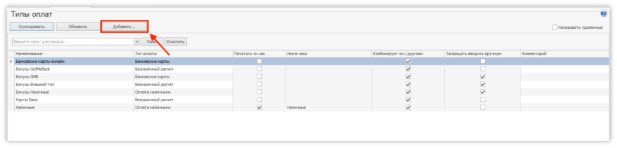

4. Заполните поля так, как написано ниже, и сохраните настройки: 
- Наименование – Бонусы GetMeBack 
- Тип – Банковские карты 
- Название в чеке – Бонусы GetMeBack 
- Запрещать вводить вручную – галочка активна 
- Можно комбинировать с другими типами оплат – галочка активна 
- Применять для всех категорий блюд – галочка активна 
- Может приниматься извне – галочка активна 
- Проведение оплаты – Только внешний 
- Код – BNCRD 
- Фискализировать как скидку – галочка активна 
- Скидка – GetMeBack 
- Скидка/надбавка – GetMeBack 

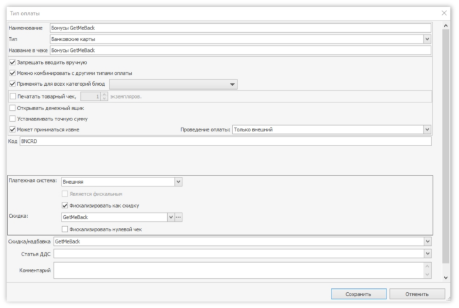

**Шаг 4. Создание типа оплаты «Банковская карта из приложения»** 

1. Откройте iikoOffice 
1. Перейдите в раздел «Розничные продажи – Типы оплат» 
1. Нажмите кнопку «Добавить» 

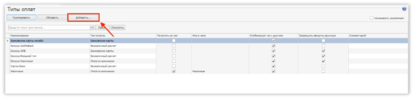

4. Заполните поля так, как написано ниже, и сохраните настройки: 
- Наименование – Банковская карта из приложения 
- Тип – Банковские карты 
- Название в чеке – Банковская карта из приложения 
- Можно комбинировать с другими типами оплат – галочка активна 
- Применять для всех категорий блюд – галочка активна 
- Может приниматься извне – галочка активна 
- Проведение оплаты – Как внешний, так и на стороне ресторана 
- Код – CCARD 

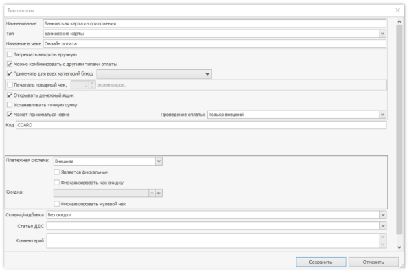

**Шаг 5. Настройка Cloud API** 

1. Откройте личный кабинет iikoWeb. 

2. Выберите раздел «Настройки Cloud API». 
2. Нажмите кнопку «Добавить интеграцию». 

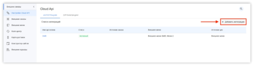

4. Заполните поля, как указано ниже: 
1. Интеграция активна – галочка включена 
1. Имя – GetMeBack\_App или на усмотрение бизнеса 
1. Шаблон прав – все права 
1. Внешнее меню – можно ничего не выбирать 
1. Источник цен – на усмотрение бизнеса 
1. Email – на усмотрение бизнеса 
1. Источник заказа – Приложение GetMeBack 
1. Подключенные точки – на усмотрение бизнеса 

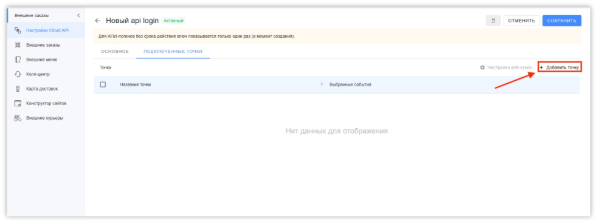

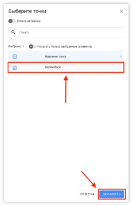

5. Скопируйте API-ключ. 
5. Нажмите кнопку «Cохранить». 

   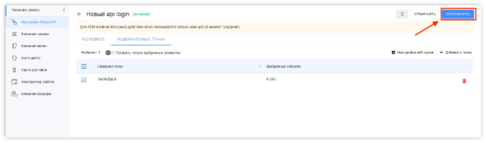**Шаг 6. Подключение iikoDelivery в личном кабинете GetMeBack** 

1. Откройте личный кабинет GetMeBack. 
1. Перейдите в раздел «Настройки – Интеграции – iikoDelivery». 
1. Нажмите кнопку «Подключить». 

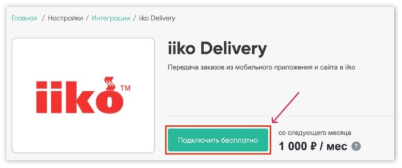

4. Нажмите «Изменить» и введите API-ключ от внешнего меню iiko. 

5. Нажмите «Сохранить и Проверить». 

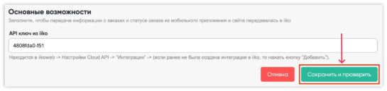

6. Убедитесь, что передача информации о заказах и статусах заказов работает. 

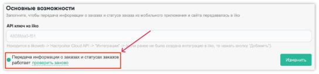

**Шаг 7. Выбор терминала в торговой точке в личном кабинете GetMeBack** 

1. Откройте личный кабинет GetMeBack. 
1. Перейдите в раздел «Настройки – Торговые точки» 
1. Нажмите «Редактировать» на торговой точке 

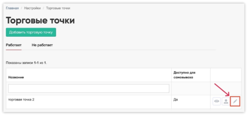

4. Выберите в выпадающем списке пункта «Организация (IIKO)» соответствующую 

организацию. 

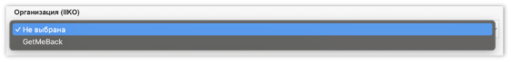

5. Выберите в выпадающем списке пункта «Терминал (IIKO)» соответствующий 

терминал. Именно на него будут поступать заказы для самовывоза или доставки в радиусе этой торговой точки. 

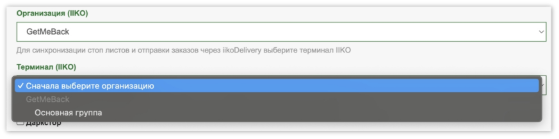

6. Нажмите «Сохранить». 
6. Сопоставьте таким же образом все торговые точки с терминалами iiko. 

**Шаг 8. Сопоставление товаров в личном кабинете GetMeBack** 

1. Откройте личный кабинет GetMeBack. 
1. Перейдите в раздел «Товары и категории – Товары». 
1. Выберите товар из каталога и нажмите на него. 
1. Перейдите в раздел «Каталог и характеристики» в этом товаре. 
1. Выберите в выпадающем списке пункта «Связанный товар в iiko (для Delivery)» 

соответствующую позицию из iiko для этого товара. 

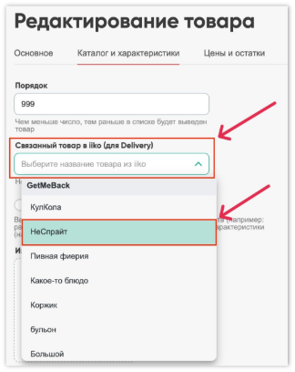

6. Нажмите кнопку «Сохранить». 
6. Сопоставьте таким же образом все товары из каталога приложения с товарами 

из внешнего меню iiko. 
11 ![ref1]

[ref1]: Aspose.Words.9911f68b-592e-4209-86d2-15b3d84e3c05.003.jpeg
