Редакция №3 от 11.02.2025  

**Настройка плагина GetMeBack на iiko** 

**Содержание инструкции** 

1. [Подготовка .............................................................................................................. 1 ](#_page0_x83.00_y377.92)
1. [Обязательная настройка........................................................................................ 1 ](#_page0_x83.00_y493.92)
1. [Настройка выдачи подарка за штампы ................................................................. 6 ](#_page5_x83.00_y73.92)
1. [Настройка разделения чека на разные юридические лица................................. 7 ](#_page6_x83.00_y73.92)
1. [Настройка подарков за баллы ............................................................................... 9 ](#_page8_x83.00_y73.92)
1. [Настройка iikoWaiter ............................................................................................. 10 ](#_page9_x83.00_y73.92)
1. [Настройка стоп-листов ......................................................................................... 12 ](#_page11_x83.00_y73.92)
1. [Как обновить плагин? ........................................................................................... 17 ](#_page16_x83.00_y73.92)
1. [Как отправить логи в поддержку GetMeBack? .................................................... 20 ](#_page19_x83.00_y73.92)
1. **Подготовка**

   Для установки плагина нужно приобрести лицензию GetMeBack iikoConnector for GetMeBack у вашего дилера. Если лицензия уже приобретена, можно переходить к настройке плагина. 

   Плагин работает на версии iiko от 8.7.7 и выше. Если у вас установлена версия ниже, рекомендуем ее обновить на последнюю. 
2. # **Обязательная настройка** 
1. Скачайте плагин (архив GetMeBackPaymentPlugin) на кассу по[ ссылке>> ](https://getmeback.ru/upload/integrations/iiko/GetMeBackPaymentPlugin.zip)
1. Распакуйте архив в папку на кассе по следующему пути:  

   C:\Program Files\iiko\iikoRMS\Front.Net\Plugins\GetMeBackPaymentPlugin. 

3. Завершите работу программы iiko front и запустите ее снова. 
3. Перейдите в настройки (три полоски справа сверху). 

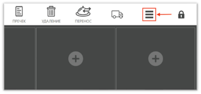

![ref1]

5. Нажмите на «Дополнения». 

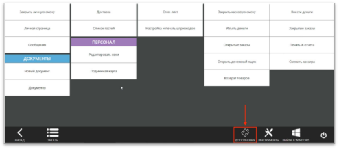

6. Нажмите на «GetMeBack». 

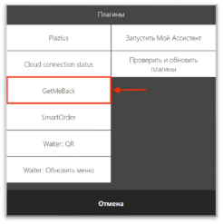

7. Нажмите «Настройки плагина». 

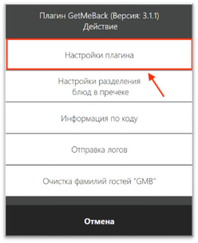![ref1]

8. Введите URL  

(веб-адрес из раздела «Интеграции» - «iiko» личного кабинета GetMeBack*).* 

9. Введите Api Key  (API ключ из раздела «Интеграции» - «iiko» личного кабинета GetMeBack).* 
9. Введите Branch ID  (внешний ID, который вы придумываете самостоятельно и вписываете в раздел «Настройки» - «Торговые точки» - «Редактирование торговой точки» личного кабинета GetMeBack. Для каждой торговой точки должно быть свое значение, одинаковых быть не может). 
9. Если параметры введены правильно, то появится надпись «Настройка успешно завершена». 
9. Откройте iikoOffice и перейдите в раздел «Дисконтная система – Скидки и надбавки». 
9. Нажмите кнопку «Добавить» и заполните поля, как указано ниже, и нажмите «Сохранить». 
- Название – GetMeBack 
- Название в пречеке – GetMeBack 
- Поставьте галочки на все места продаж 
- Поставьте галочки на все режимы обслуживания 
- Поставьте галочку «Можно использовать с другими скидками» 
- Поставьте галочку «Учитывать скидку при расчете НДС, не включенного в стоимость» 
- Метод применения – К полной сумме заказа 
- Тип – Скидка и Фиксированная сумма 
- Поставьте галочку «Назначать сумму» 
- Поставьте галочку «Применять для всех категорий блюд» 
- Поставьте галочку «Активировать скидку» 

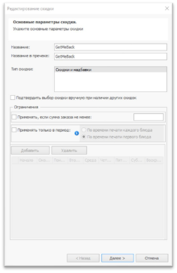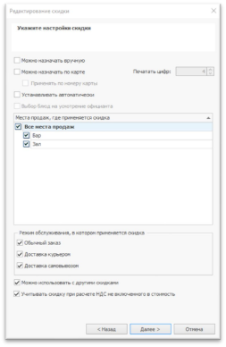

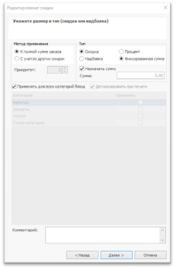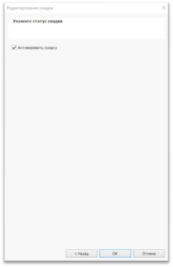

14. Перейдите в раздел «Розничные продажи - Типы оплаты». 
14. Нажмите кнопку «Добавить» и заполните поля, как указано ниже, и нажмите «Сохранить». 
- Название – GetMeBack 
- Название в чеке – на ваше усмотрение, например «Баллы» 
- Поставьте галочку «Можно комбинировать с другими типами оплаты» 
- Поставьте галочку «Применять для всех категорий блюд» 
- Поставьте галочку «Открывать денежный ящик» 
- Счет выручки – Торговая выручка без учета скидок 
- Счет поступления денег – Денежные средства, эквайринг 
- Поставьте галочку «Проводить как скидку» 
- Скидка – GetMeBack 

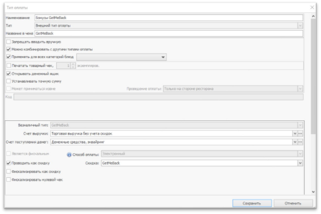

16. Перейдите в раздел «Администрирование -Ннастройки торгового предприятия». 
16. Поставьте галочку «Разрешить текстовые комментарии к позициям заказа» во всех местах приготовления. 

    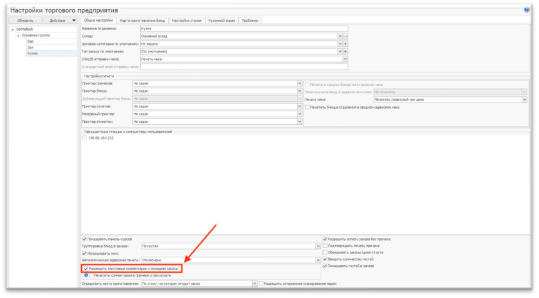
# **3. Настройка выдачи подарка за штампы** 
1. Откройте iikoOffice. 
1. Перейдите в раздел «Товары и склады - Блюда». 
1. Выберите блюда/товары, которые вы хотите предлагать клиентам выдать в качестве подарка, и сохраните список артикулов. Если артикул не заполнен, его можно ввести вручную. 

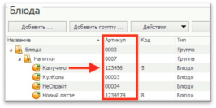

4. На рабочем столе ПК, где был установлен плагин, найдите файл GetMeBackPaymentPlugin.config.xml и откройте его.  

   Обычно он находится по следующему пути: Диск C - Users - User - AppData - Roaming - iiko - CashServer - PluginConfigs - GetMeBackPaymentPlugin2.0 

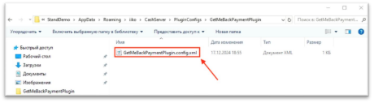

5. Впишите строки с артикулами подарков за накопленные штампы в формате: <StampGifts>артикул товара</StampGifts>.  

   Вместо «Артикул товара» необходимо указать реальный артикул блюда из кассы, как в примере на скриншоте. Сотрудник сможет выбрать одну позицию из списка в качестве подарка в интерфейсе кассы. 

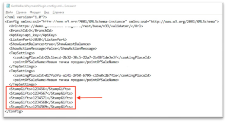
# **4. Настройка разделения чека на разные юридические** 
# **лица** 
1. Откройте iikoFront. 
1. Перейдите в настройки (три полоски справа сверху). 

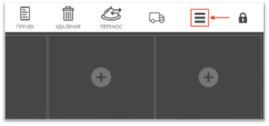

3. Нажмите на «Дополнения». 

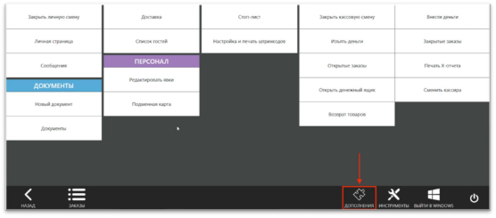

4. Нажмите на «GetMeBack».  

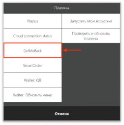

5. Нажмите «Настройка разделения блюд в пречеке». 

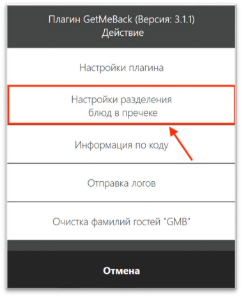

6. Выберите место приготовления и нажмите на него. 

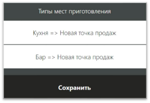

7. Выберите кассу для этого места приготовления. 

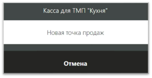

8. Сопоставьте остальные типы мест приготовления. 
# **5. Настройка подарков за баллы** 
1. Откройте iikoOffice. 
1. Перейдите в раздел «Товары и склады - Блюда». 
1. Выберите блюда/товары, которые вы хотите предлагать клиентам выдать в качестве подарка, и сохраните список артикулов. Если артикул не заполнен, его можно ввести вручную. 

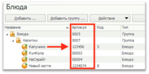

4. Откройте личный кабинет GetMeBack. 
4. Перейдите в раздел «Программа лояльности – Подарки за баллы». 
4. Нажмите на кнопку «Редактировать» (карандаш) у существующего подарка или создайте новый. 

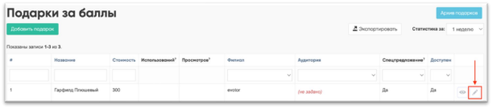

7. Впишите артикул блюда, которое будет добавлено в заказ при покупке этого подарка. 

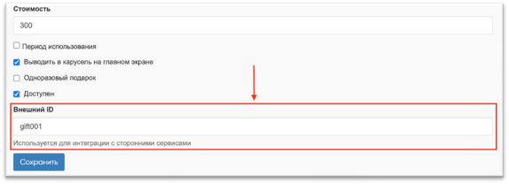

8. Сохраните изменения и сопоставьте остальные подарки с артикулами блюд.  

**6. Настройка iikoWaiter** 

Убедитесь, что вы корректно настроили плагин на первом и втором пункте инструкции (стр.1-5). Если функционал списания и начисления баллов работает, то вы можете приступить к настройке iikoWaiter.  

1. Откройте iikoFront от администратора. 
1. Скачайте и установите последнюю версию плагина Waiter по ссылке [https://disk.iiko.pro/plugins/WaiterServer/.](https://disk.iiko.pro/plugins/WaiterServer/) 
1. Откройте логи плагина GetMeBack 

   ` `(название файла plugin-GetMeBackPaymentPlugin.log) 

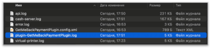

4. Найдите в них запись ««id типа оплаты 1187269d0986443a-84de- 65c8c6464941 для Waiter». ID у каждого свой и уникальный.  

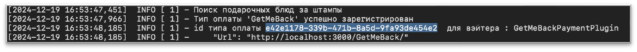

5. Скопируйте этот ID. 
5. Закройте iikoFront. 
5. Откройте файл «WaiterServerConfig.json».  

   Обычно он находится по следующему пути: \AppData – Roaming – iiko – CashServer – PluginConfigs – WaiterServer –  WaiterServerConfig.json 

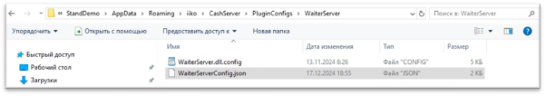

8. Найдите раздел «ExternalLoyalty», именно в нем вносите правки. 

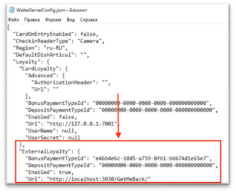

9. Вставьте скопированный ID в строку «BonusPaymentTypeId». 

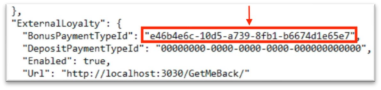

10. Выберите свободный порт, например 3000. 

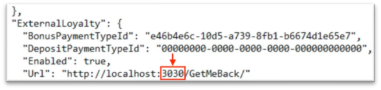

11. Запустите iikoFront от администратора. 
11. Откройте веб-сервер iikoWaiter по ссылке[ http://localhost:8100/settings.](http://localhost:8100/settings) 
11. Найдите раздел «ExternalLoyalty» и нажмите на кнопку «Check connection». 

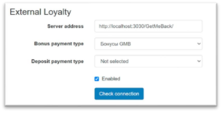

14. Если в уведомлении написано «Successfully connected», все настроено верно. 

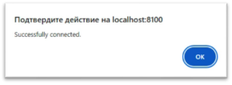
# **7. Настройка стоп-листов** 
**Стоп-лист** — это список блюд, которые отмечаются на всех кассовых терминалах заведения как временно недоступные для продажи. Блюда, которые были добавлены в стоп-лист также будут недоступны для заказа через приложение для гостей. 

1. Откройте iikoOffice. 
1. Выберите раздел «Обмен данными – Выгрузка меню» 
1. Выберите Папки/Товары/Услуги, которые планируете добавить во внешнее меню. 
1. Нажмите «Добавить выбранные товары». 

   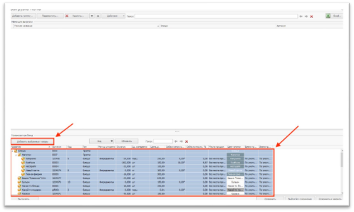

5. Убедитесь, что вы добавили все товары, которые должны быть в каталоге приложения от GetMeBack. 
5. Нажмите «Сохранить». 

   7. Откройте «iikoWeb – Настройки Cloud API – Интеграции». 

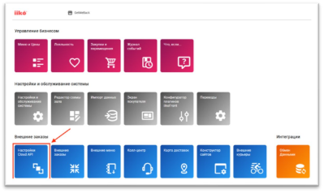

8. Нажмите кнопку «Добавить интеграцию». 

   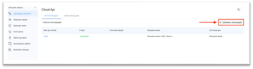

9. Заполните поля, как указано ниже: 
- Интеграция активна – Галочка включена 
- Имя – GetMeBack\_App или на усмотрение бизнеса 
- Шаблон прав – Все права 
- Внешнее меню – Можно ничего не выбирать 
- Источник цен – На усмотрение бизнеса 
- Email – На усмотрение бизнеса 
- Источник заказа – Приложение GetMeBack 

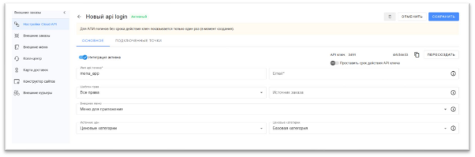

10. Скопируйте и вставьте в заметки API ключ интеграции, он понадобится позже. 
10. Перейдите в раздел «Подключенные точки» 

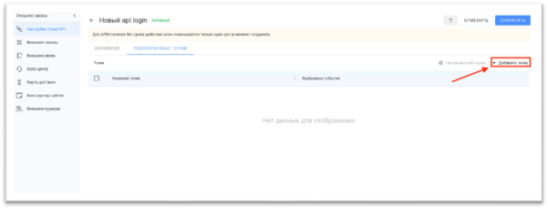

12. Нажмите «Добавить точку». 
12. Выберите торговые точки, где должна работать интеграция со стоп-листами. 
12. Нажмите «Добавить». 

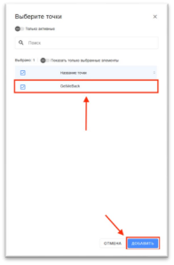

15. Нажмите на «Настройка веб-хуков» 
15. Заполните поля, согласно информации: 
- URL – находится в личном кабинете GetMeBack в разделе «Настройки – Интеграции – iiko», называется «Веб-адрес» 
- Токен авторизации – находится в личном кабинете GetMeBack в разделе «Настройки – Интеграции – iiko», называется «API ключ» 
17. Перейдите в раздел «фильтры» и выберите вариант «отправлять» в строке «Стоп-листы – Обновления». 

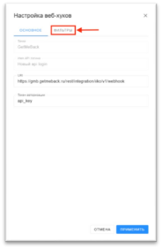 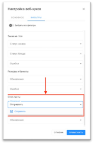

18. Нажмите кнопку «Применить». 
18. Откройте личный кабинет GetMeBack. 
18. Перейдите в раздел «Настройки – Интеграции – iiko». 
18. Нажмите кнопку «Подключить бесплатно». 

    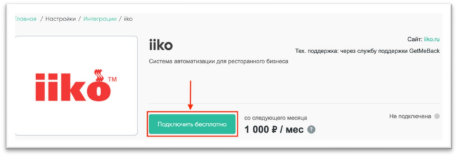

22. Нажмите «Изменить» и введите API-ключ от внешнего меню iiko. 

    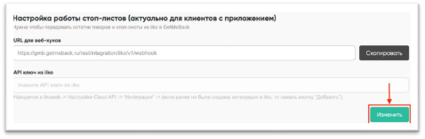

23. Нажмите «Сохранить и проверить». 

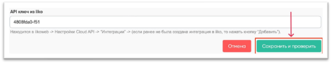

24. Перейдите в раздел «Настройки – Торговые точки». 
24. Нажмите «Редактировать» на торговой точке. 

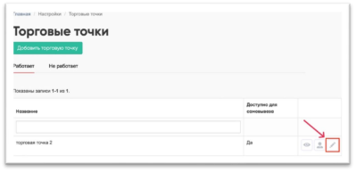

26. Выберите в выпадающем списке пункта «Организация (iiko)» соответствующую организацию. 

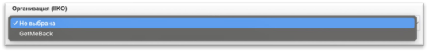

27. Выберите в выпадающем списке пункта «Терминал (iiko)» соответствующий терминал. Именно на него будут поступать заказы для самовывоза или доставки в радиусе этой торговой точки. 

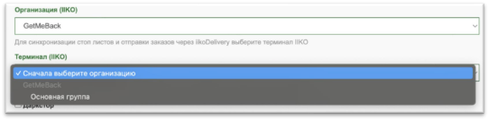

28. Нажмите «Сохранить». 
28. Сопоставьте таким же образом все торговые точки с терминалами iiko. 
28. Перейдите в раздел «Товары и категории – Товары». 
28. Выберите товар из каталога и нажмите на него. 
28. Перейдите в раздел «Каталог и характеристики» в этом товаре. 
28. Выберите в выпадающем списке пункта «Связанный товар в iiko (для Delivery)» соответствующую позицию из iiko для этого товара. 

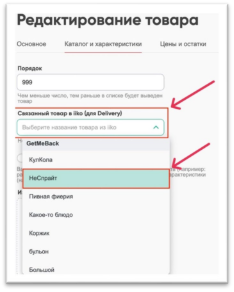

34. Нажмите кнопку «Сохранить». 
34. Сопоставьте таким же образом все товары из каталога приложения с товарами из внешнего меню iiko. 
# **8. Как обновить плагин?** 
1. Скачайте актуальную версию плагина по[ ссылке>> ](https://getmeback.ru/upload/integrations/iiko/GetMeBackPaymentPlugin.zip)и распакуйте/извлеките файлы из архива с плагином, который вы скачали. 

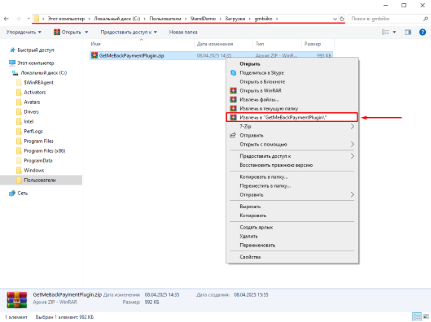

2. Закройте iikoFront.. 
2. Найдите на кассе папку GetMeBackPaymentPlugin.zip и откройте ее (чаще всего она находится по следующему пути: диск C → ProgramFiles → iiko → iikoRMS → Front.Net → Plugins → GetMeBackPaymentPlugin). И удалите, все содержимое этой папки.   

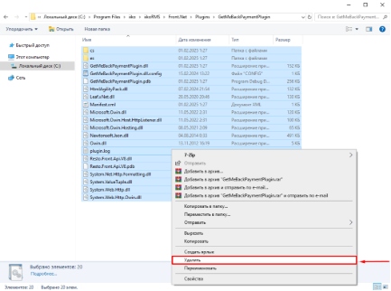

4. Скопируйте и вставьте два файла из скаченного архива GetMeBackPaymentPlugin,zip в папку GetMeBackPaymentPlugin. 

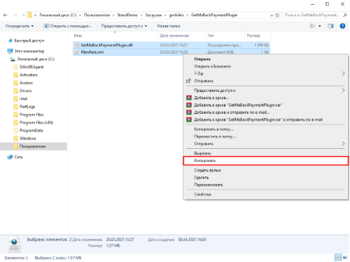

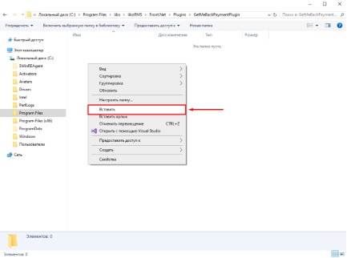

5. Нажмите, правой кнопкой мыши на ярлык iikoFront с рабочего стола, выберите "Свойства", перейдите в раздел совместимость и убедитесь, что в Параметрах стоит галочка "Запускать эту программу от имени администратора". 

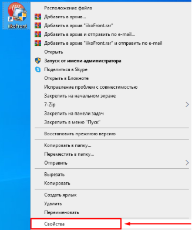

6. Запустите iikoFront. 

**9. Как отправить логи в поддержку GetMeBack?** 

1. Откройте iikoFront. 
1. Перейдите в настройки (три полоски справа сверху). 

3. Нажмите на «Дополнения». 

4. Нажмите на «GetMeBack». 

5. Нажмите «Отправка логов». 
5. Нажмите на «Выбрать период». 

 

7. Выберите дату начала периода и нажмите «ОК». 

8. Выберите дату конца периода и нажмите «ОК».  

21 ![ref1]

[ref1]: Aspose.Words.6d269c2a-ab8d-4218-93af-8e7c577d9a76.002.png
