Пошаговая инструкция для кассира по работе с плагином GetMeBack в IIKO Редакция от 01.08.2025 

1. Запуск программы IIKO Front.  

Программу обязательно нужно запустить от имени администратора, после появится окно с вводом пароля в кассу. 

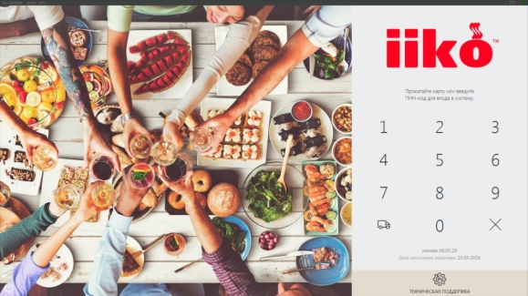

2. Переходим к созданию заказа, для этого, если нам известен стол, выбираем номер стола или заходим в быстрый чек.

   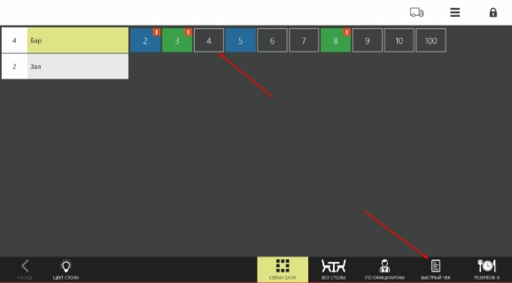

3. Добавляем позиции в заказ и нажимаем на кнопку «GetMeBack» 

4. Сканируем QR-код или вводим код с карты клиента вручную. Код в себе может содержать 2 действия – авторизация или авторизация с выдачей подарка. 

   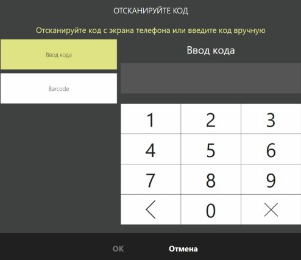

5. После успешного сканирования QR-кода или ввода кода с карты клиента появится информация о госте, его балансе бонусов и номере телефона. 

   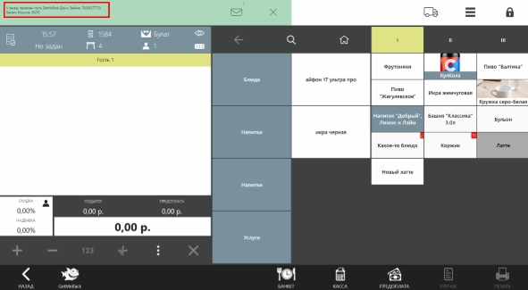

   При сканировании QR-кода подарка появится окно с гостем и в позициях появится подарок 

   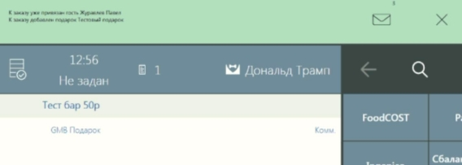

6. Если клиента потребуется удалить из заказа, нажмите на кнопку «GetMeBack», «Удалить гостя»

   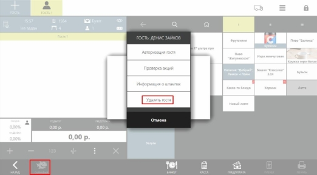

7. Для проверки доступных акций или количества накопленных штампов нажмите соответствующие кнопки «Проверка акций» и «Информация о штампах» 

   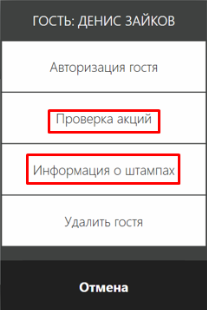

8. Для оплаты нажимаем на кнопку «Касса» 

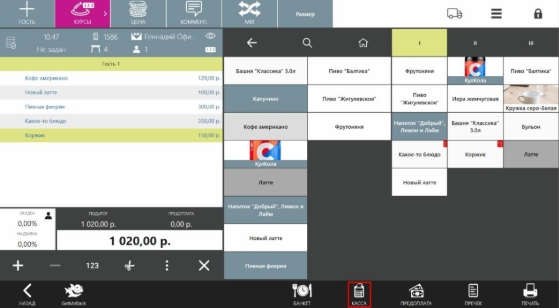

9. В случае списания/начисления бонусов есть 2 сценария: 
1) Клиент решил копить бонусы. Проводим оплату как обычно, выбираем оплатить наличными либо картой 
1) Клиент решил списать бонусы. Нажимаем на кнопку «БЕЗНАЛ. РАСЧЕТ» и выбираем способ оплаты: «Бонусы GetMeBack» 

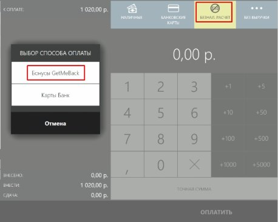

10. При выборе оплаты бонусами, будет указана максимальная сумма, доступная для списания. Её можно изменить, если клиент решил списать часть бонусов. Также будет отображаться информация об оставшейся сумме, которую клиенту нужно будет оплатить 

    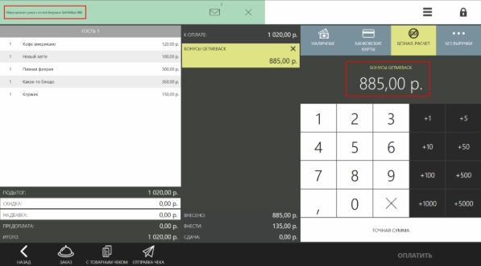Оставшуюся сумму клиенту нужно будет оплатить наличными либо картой. Чтобы кассиру вручную не вводить, можно нажать на кнопку «Точная сумма» и программа автоматически посчитает за вас. 

    

    После проведения оплаты стол будет закрыт, появится сообщение об успешном списании бонусов 

    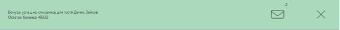

    Если у вас появились ошибки при работе плагина, напишите в WhatsApp по номеру 

    +7 812 407 2785 или Telegram @getmeback\_support, а также на почту [support@getmeback.ru ](mailto:support@getmeback.ru)

    Информация, которая потребуется поддержке для понимания, с чем может быть связана ошибка: 

    Отправьте фото или видео с ошибкой, желательно увидеть момент появления ошибки, чтобы постараться её воспроизвести и устранить. А также для детального исследования отправьте логи, для этого откройте в главном меню iiko «Дополнения» - «GetMeBack» и нажмите на кнопку «Отправка логов» 

    

    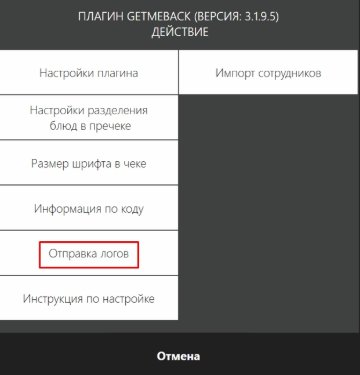
`          `Тех. Поддержка с 8:00 до 20:00 по МСК по рабочим дням 

+7 (812) 407-27-85 WhatsApp или телефон, телеграм @getmeback\_support, support@getmeback.ru
