Настройка интеграции плагина GetMeBack с iikoWaiter 

[**Предварительная настройка интеграции с системой iiko** ............................................................ 2 ](#_page1_x69.00_y72.68)[**Подключение плагина GetMeBack к iikoWaiter** ............................................................................... 4 ](#_page3_x69.00_y72.68)[**Работа с QR-кодом гостя и добавление подарка в заказ** ............................................................. 6 ](#_page5_x69.00_y72.68)[**Как добавить в заказ ещё один подарок?** ..................................................................................... 10 ](#_page9_x69.00_y72.68)[**Настройка оплаты заказа бонусами GetMeBack** .......................................................................... 11 ](#_page10_x69.00_y72.68)[**Оплата наличными подотчет** .......................................................................................................... 13 ](#_page12_x69.00_y72.68)

**Предварительная настройка интеграции с системой iiko**  

Перед началом работы с iikoWaiter необходимо провести интеграцию с системой iiko. Для этого в личном кабинете GetMeBack перейдите в раздел Настройки → Интеграции  

→ выберите iiko из списка интеграций.   

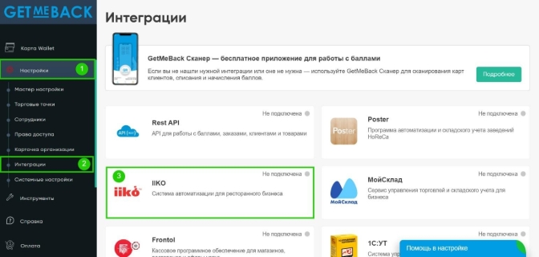

Далее нажмите «Подключить бесплатно» и прокрутите страницу вниз до конца.  

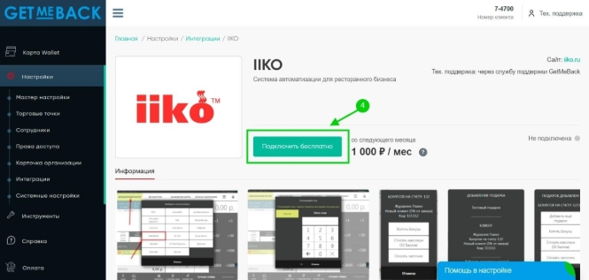На этой же странице в последнем блоке «Подключение» скачайте плагин GetMeBack и произведите его настройку с системой iiko по инструкции – её можно скачать, кликнув на пункт «Инструкция по подключению».  

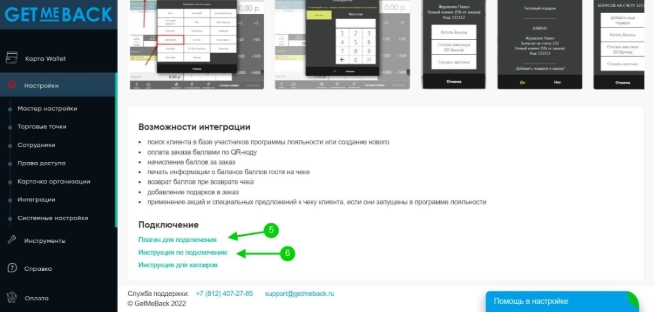

Далее после настройки интеграции с iiko, можно продолжить настройку iikoWaiter.  

**Подключение плагина GetMeBack к iikoWaiter**  

Для настройки интеграции плагина GetMeBack с решением iikoWaiter, необходимо прописать в настройках iikoWaiter адрес и порт плагина GetMeBack.  

IP-адрес указывается или главной кассы, или 127.0.0.1, если плагин iikoWaiter установлен на той же кассе, что и плагин GetMeBack.  

Порт плагина GetMeBack – 3000  

После порта указывается путь /GetMeBack  

Пример настройки:[ http://192.168.0.108:3000/GetMeBack, ](http://192.168.0.108:3000/GetMeBack)где:  

192\.168.0.108 – пример IP адреса кассы (укажите IP-адрес главной кассы или укажите  

127\.0.0.1, если плагин iikoWaiter установлен на той же кассе, что и плагин GetMeBack.  

3000 – порт плагина GetMeBack  /GetMeBack – путь после порта.  

В настройках iikoWaiter найдите пункт External Loyalty и пропишите получившийся адрес в поле Server Address, как показано на скриншоте ниже.  

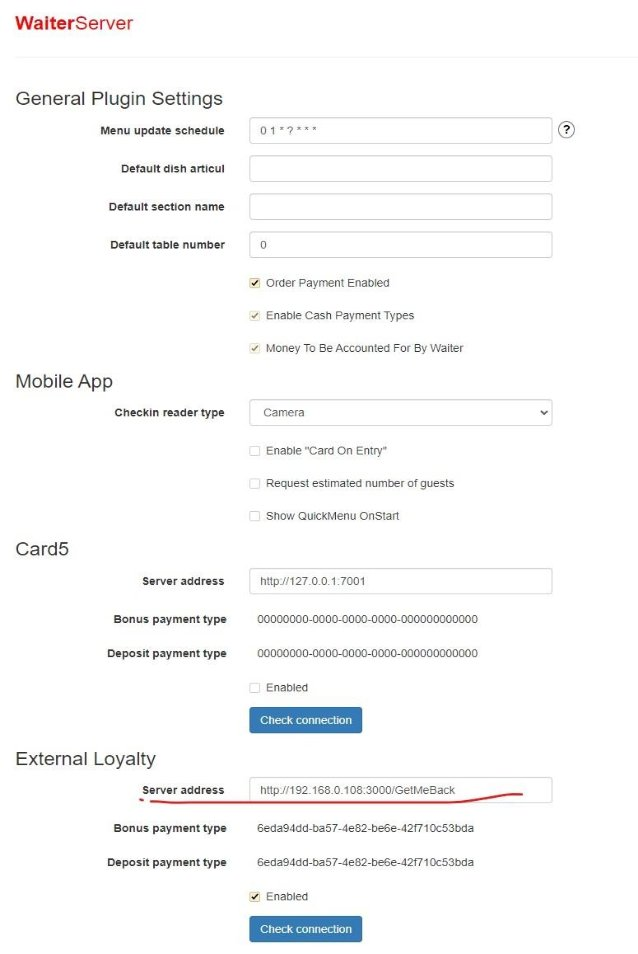

**Работа с QR-кодом гостя и добавление подарка в заказ**  

После завершения настройки интеграции, в приложении iikoWaiter можно сканировать QR-код гостя или QR-код подарка в GetMeBack.  

Для этого в приложении iikoWaiter необходимо:  

\1) Внутри заказа нажать кнопку                 2) Нажать кнопку «Чекин»:       

с пиктограммой принтера:

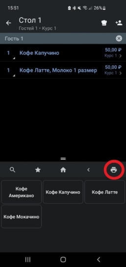 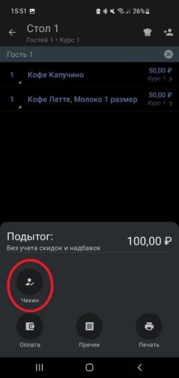

3) Отсканировать QR-код гостя или подарка:  

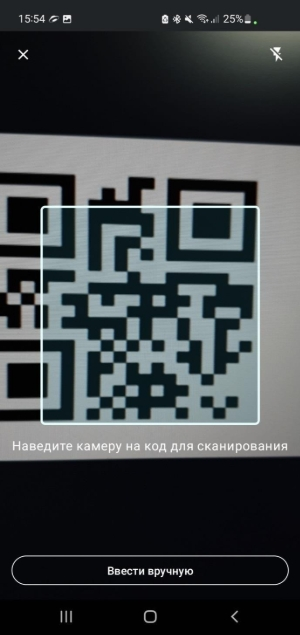

4) После сканирования в приложении отобразится ФИО гостя и его баланс бонусов.  Если был отсканирован QR- код подарка, то появится также кнопка с названием подарка.   

С подарком                                              Без подарка  

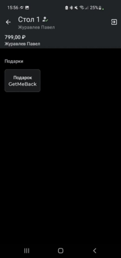 

При нажатии на кнопку с названием подарка, блюдо автоматически добавится в заказ.  

При оплате с клиента спишутся баллы за этот подарок согласно 

настройкам системы лояльности.  

Подарок, добавленный в заказ  

**Как добавить в заказ ещё один подарок?** 

При необходимости добавить в заказ ещё один подарок, нужно:  

- снова зайти в «Чекин» гостя;   
- нажать на кнопку «Чекаута» гостя в правом верхнем углу экрана;  
- снова нажать «Чекин» и отсканировать QR-код подарка.   

После этого будет отображаться 2 подарка.   

**Если нужно отсканировать ещё больше подарков - действия аналогичны.**  

`                      `Чекаут гостя                                      2 подарка в заказе после сканирования                                                                                                           2-го QR кода  

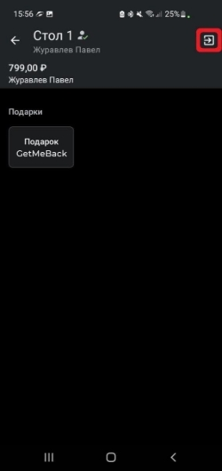 

**Настройка оплаты заказа бонусами GetMeBack**  

Если в настройках плагина iikoWaiter в поле «**Bonus payment type**» указать ID типа оплаты GetMeBack, то при распечатке пречека с мобильного приложения iikoWaiter можно указать, какая сумма от заказа будет оплачена бонусами GetMeBack  (при наличии возможности оплаты). Эту сумму можно скорректировать в пределах доступного максимума для оплаты.  

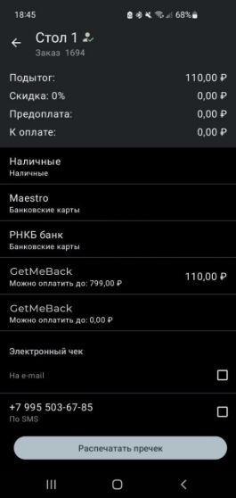

Если при распечатке пречека в приложении указать сумму для оплаты бонусами, плагин iikoWaiter - при оплате заказа на кассе - автоматически подставит эту сумму для оплаты, но её можно будет скорректировать.  

Функционал работы с плагином GetMeBack на iikoFront остается прежним. Если в заказ был добавлен подарок или гость через мобильное приложение, то плагин в iikoFront подскажет это при выборе типа оплаты GetMeBack при оплате.  

**Оплата наличными подотчет** 

Принятие наличных денежных средств от гостей всегда сопряжено с финансовыми рисками и возможностью злоупотреблений со стороны персонала. Для целей минимизации данных рисков реализована возможность настройки обязательности оплат наличными под отчет официанту. 

**Настройка плагина** 

По умолчанию настройка об оплате наличными под отчет официанту включена. Для того чтобы ознакомиться с текущей настройкой перейдите на WEB страницу настройки плагина. За указанную настройку отвечает поле “Money To Be Accounted For By Waiter”. 

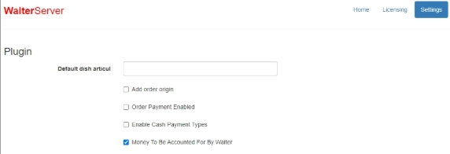

**Настройка прав пользователей** 

Для возможности оплачивать и закрывать заказы непосредственно с мобильного приложения Waiter сотрудникам требуется разрешение следующих прав: 

- Для возможности добавления и удаления оплат к заказу 
- PS\_ADM - Проводить административные операции с платежными системами 
- F\_CGC Изменять количество гостей  
- F\_CHO Открывать заказы в качестве официанта 
- D\_DEP - Удалять внешние платежи 
- F\_PAW - Принимать оплату в качестве официанта 
- Для возможности оплачивать заказы 
- F\_CASH - Принимать платежи 
- Для возможности проводить наличные оплаты (для учета задолженности официантов) 
- F\_APIO - Авторизовывать кассовые внесения и изъятия 

**Настройка типов внесения/изъятия** 

Для возможности оплачивать и закрывать заказы наличными денежными средствами в подотчет необходимо настроить типы внесения/изъятия. 

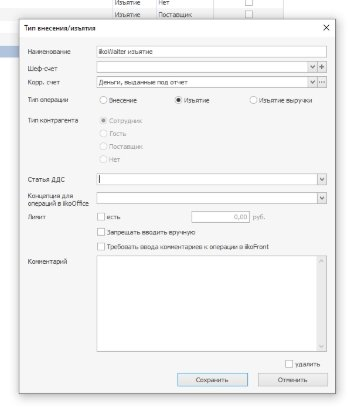

Далее указать созданные типы на вкладке “Настройки учета” в разделе администрирования настроек Торгового предприятия, а также установить галочку “Деньги под отчет официанту”. 

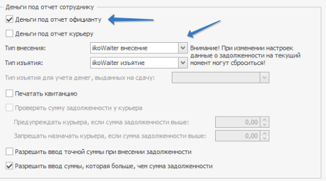

По окончании настройки все наличные платежи, произведенные через Waiter, будут формировать задолженность официанта. 

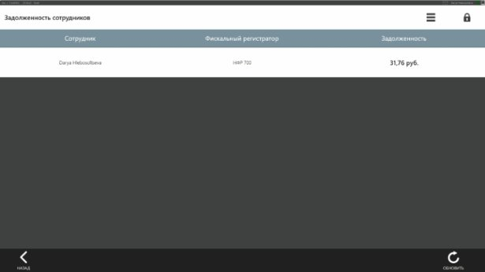
`                               `Вы можете обратиться за помощью к вашему менеджеру            

или по телефону +7 (812) 407-27-85 
