Редакция №1 от 16.12.2024 

**Инструкция для кассира по интеграции** 

**GetMeBack с МойСклад**  

**Начисление баллов** 

1. Добавьте товары в заказ 
1. Нажмите на кнопку «Покупатель» 

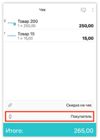

3. Отсканируйте QR-код или введите номер карты клиента вручную 
3. Нажмите на строку с клиентом 

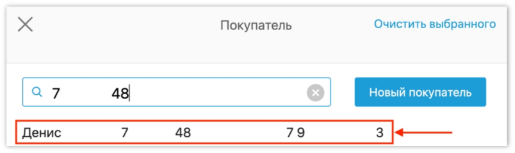

5. Убедитесь, что карта клиента авторизована в заказе. На кнопке клиент должно быть имя и баланс баллов. 

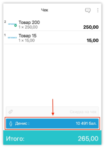

6. Нажмите на кнопку «Итого» 

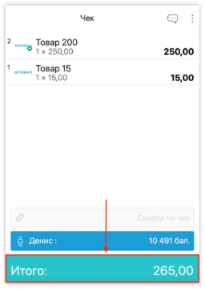

7. По умолчанию в заказе будет выбран вариант «начисление». Однако мы всегда рекомендуем это проверять. 

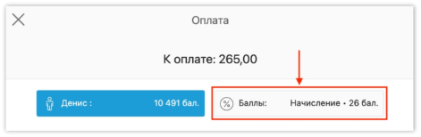

8. Оплатите заказ картой или наличными и закройте его. Баллы будут начислены автоматически. 

**Списание баллов** 

1. Добавьте товары в заказ 
1. Нажмите на кнопку «Покупатель» 

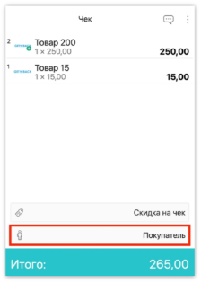

3. Отсканируйте QR-код или введите номер карты клиента вручную 
3. Нажмите на строку с клиентом 

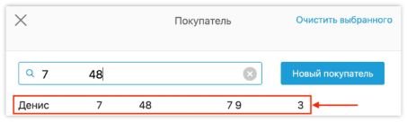

5. Убедитесь, что карта клиента авторизована в заказе. На кнопке клиент должно быть имя и баланс баллов. 

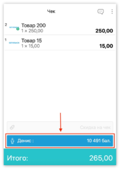

6. Нажмите на кнопку «Итого» 

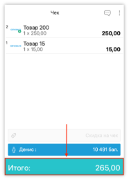

7. Нажмите на кнопку «Баллы» 

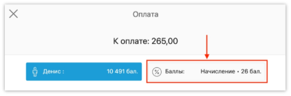

8. Нажмите на вариант «списание» 

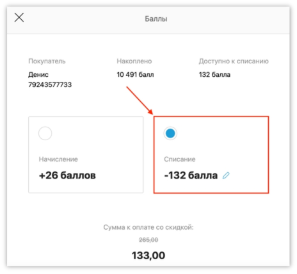

9. Нажмите на кнопку «Закрыть» снизу 

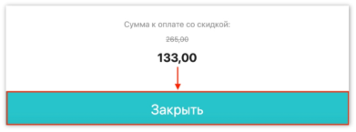

10. Оплатите остаток картой или наличными и закройте заказ. Если у вас включена функция «Разрешить списание и начисление баллов в одном чеке» в GetMeBack, то на остаток (133 рубля из примера) будут начислены баллы, несмотря на то, что вы выбрали вариант «Списание». 

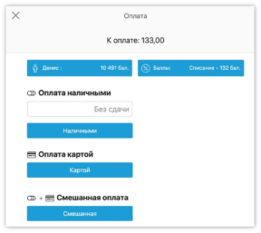

**Как удалить карту клиента из заказа?** 

1. Нажмите на кнопку с клиентом 

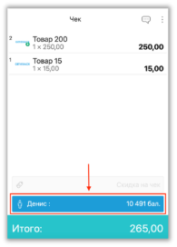

2. Нажмите на кнопку «Очистить выбранного» 

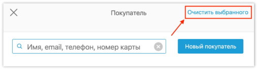

3. Убедитесь в том, что карта клиента удалена из заказа. На кнопке «покупатель» не должно быть имени и баланса. 

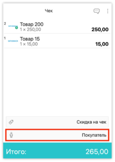
8 

