Интеграция для МойСклад 

Шаг 1. Установка приложения 

1. Нажмите на кнопку «Установить» 

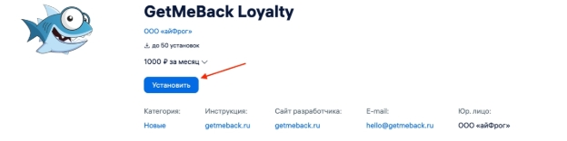

2. Нажмите «Продолжить установку» 

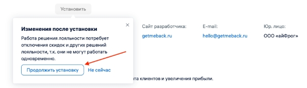

3. Нажмите на кнопку «Перейти в решение» 

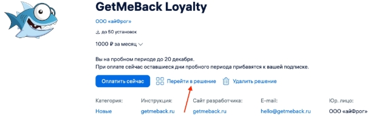

4. Если у вас уже есть кабинет в GetMeBack, заполните поля для активации плагина и нажмите кнопку «Активировать» 
- **Домен в GetMeBack** – это название вашего кабинета, например moskladloyal. 
- **E-mail администратора или логин в GetMeBack** – это почта сотрудника с правами администратора. Чаще всего, это сотрудник, который создал кабинет. 
- **Пароль в GetMeBack** – пароль от учетной записи по почте, которую вы указали. 

  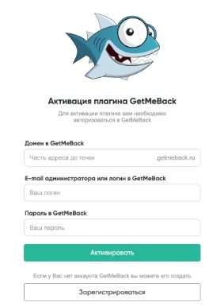

Если данные введены верно, то вы получите уведомление о том, что коннектор успешно активирован. 

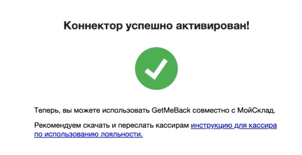

Если вы ранее не регистрировались в сервисе GetMeBack. нажмите кнопку «Регистрация» 

- Выберите тип бизнеса 
- Выберите в выпадающем списке вариант «Зарегистрироваться и бесплатно попробовать карты Wallet» 

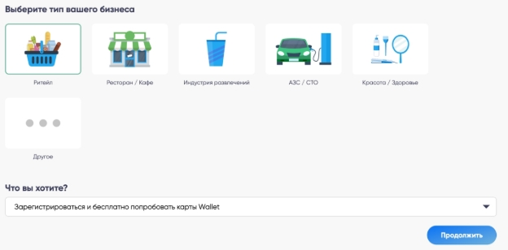

- Укажите название вашей организации 
- Укажите Имя для администратора 
- Введите номер телефона 
- Введите E-mail 
- Придумайте пароль 
- Используйте промокод, если он у вас есть 

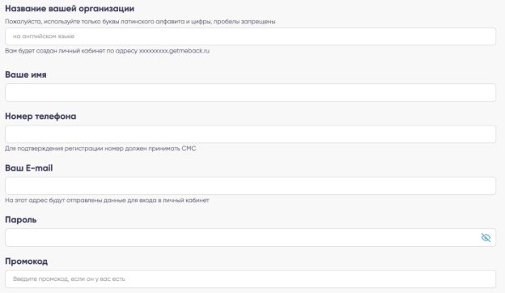

После успешного создания кабинета, вернитесь на страницу активации плагина в МойСклад и введите данные.  

Шаг 2. Импорт товаров и категорий 

Импортируйте товары и категории из МойСклад, чтобы настроить на них правила начисления и списания. 

1. Перейдите в раздел Настройки – Интеграции – МойСклад в личном кабинете GetMeBack 
1. Нажмите «Подключить» 
1. Нажмите «Изменить» в разделе Импорт товаров и категорий 
1. Заполните поле «ID организации от МойСклад» и нажмите «Сохранить и проверить» 

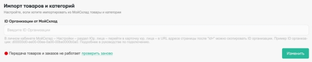

Если данные в полях корректные, вы получите уведомление о том, что авторизация прошла успешно. 

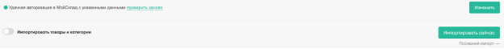

5. Нажмите «Импортировать сейчас», чтобы загрузить все товары и категории из МойСклад в GetMeBack. 
5. Если хотите повторять импорт товаров и категорий постоянно, включите тумблер «Импортировать товары и категории», укажите количество дней (с такой периодичностью будет происходить импорт) и нажмите «Применить» 

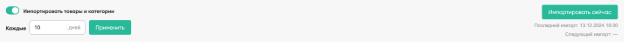

**Где найти ID организации?** 

1. В личном кабинете МойСклад перейдите в раздел «Настройки – Юр. Лица»  
1. Нажмите на карточку юридического лица 
1. В URL адресе страницы после "id=" можно скопировать ID организации. 

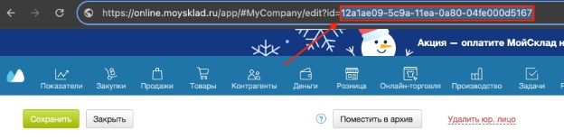

Шаг 3. Начисление баллов 

1. Добавьте товары в заказ 
1. Нажмите на кнопку «Покупатель» 

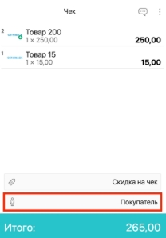

3. Отсканируйте QR-код или введите номер карты клиента вручную 
3. Нажмите на строку с клиентом 

![ref1]

5. Убедитесь, что карта клиента авторизована в заказе. На кнопке клиент должно быть имя и баланс баллов. 

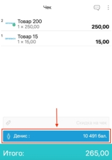

6. Нажмите на кнопку «Итого» 

![ref2]

7. По умолчанию в заказе будет выбран вариант «начисление». Однако мы всегда рекомендуем это проверять. 

![ref3]

8. Оплатите заказ картой или наличными и закройте его. Баллы будут начислены автоматически. 

Шаг 4. Списание баллов 

1. Добавьте товары в заказ 
1. Нажмите на кнопку «Покупатель» 

![ref4]

3. Отсканируйте QR-код или введите номер карты клиента вручную 
3. Нажмите на строку с клиентом 

![ref1]

5. Убедитесь, что карта клиента авторизована в заказе. На кнопке клиент должно быть имя и баланс баллов. 

![ref5]

6. Нажмите на кнопку «Итого» 

![ref2]

7. Нажмите на кнопку «Баллы» 

![ref3]

8. Нажмите на вариант «списание» 

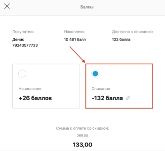

9. Нажмите на кнопку «Закрыть» снизу 

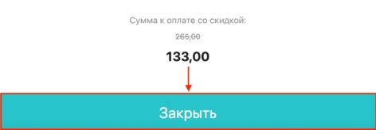

10. Оплатите остаток картой или наличными и закройте заказ. Если у вас включена функция «разрешить списание и начисление баллов в одном чеке» в GetMeBack, то на остаток (133 рубля из примера) будут начислены баллы, несмотря на то, что вы выбрали вариант «списание». 

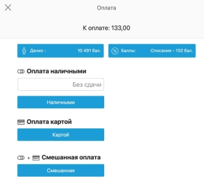

Как удалить карту клиента из заказа? 

1. Нажмите на кнопку с клиентом 

![ref5]

2. Нажмите на кнопку «Очистить выбранного» 

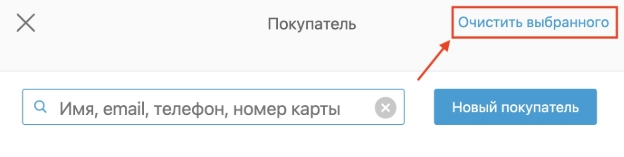

3. Убедитесь в том, что карта клиента удалена из заказа. На кнопке «покупатель» не должно быть имени и баланса. 

![ref4]

[ref1]: Aspose.Words.c44eb617-c82c-4c3a-a7ba-dda464e2db8b.013.jpeg
[ref2]: Aspose.Words.c44eb617-c82c-4c3a-a7ba-dda464e2db8b.015.jpeg
[ref3]: Aspose.Words.c44eb617-c82c-4c3a-a7ba-dda464e2db8b.016.jpeg
[ref4]: Aspose.Words.c44eb617-c82c-4c3a-a7ba-dda464e2db8b.017.jpeg
[ref5]: Aspose.Words.c44eb617-c82c-4c3a-a7ba-dda464e2db8b.018.jpeg
