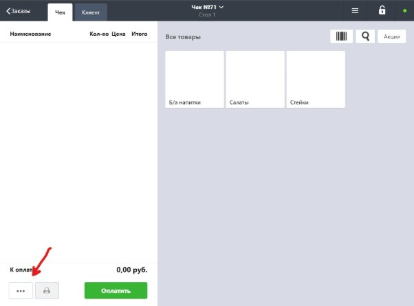
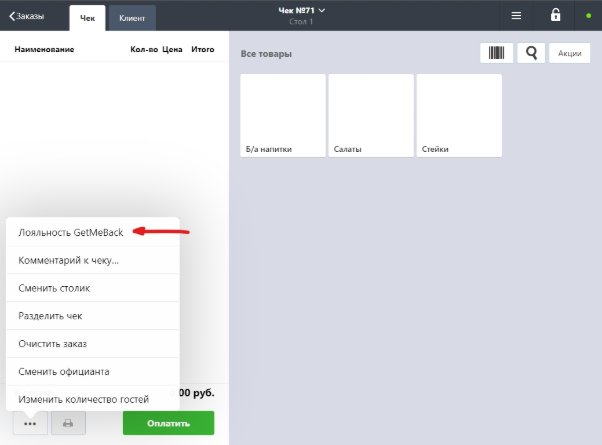
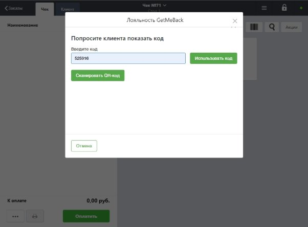
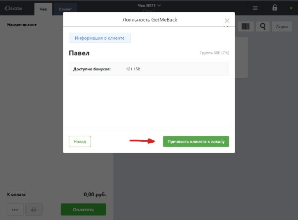
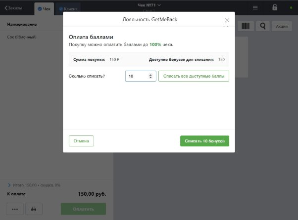
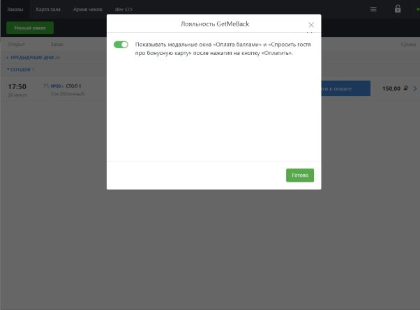
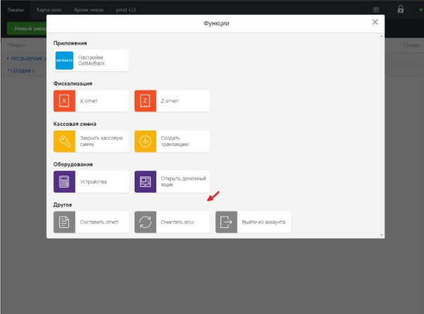

**Начисление бонусов**

1. Чтобы добавить гостя к заказу и начислить ему бонусы с заказа, необходимо **открыть меню настроек заказа** и выбрать в появившемся меню «**Лояльность GetMeBack**»:

2. В появившемся окне будет предложено **ввести или сканировать QR-код**:

После ввода кода на экране будет показана информация о госте. Чтобы баллы были начислены после оплаты заказа, необходимо привязать гостя к заказу, нажав на кнопку «**Привязать клиента к заказу**».

*Примечание:*

На этом этапе можно прервать процедуру привязку гостя просто закрыв окно, либо ввести/отсканировать другой код, нажав на кнопку «**Назад**».

**Оплата бонусами**

**Внимание**: для оплаты бонусами гость должен быть уже привязан к заказу (см. **Начисление бонусов**).

1. После нажатия на кнопку «**Оплатить**» на экране детализации заказа, система предложит **оплатить весь или часть заказа бонусами** (при условии, что у гостя они накоплены):

2. После ввода баллов (можно продолжить и без оплаты бонусами, если гость решит копить их) терминал покажет стандартный экран **Оплаты**, где сумма будет автоматически уменьшена на количество бонусов, которое было введено в предыдущем окне:

*Примечание:*

Чтобы изменить количество используемых бонусов, нужно вернуться обратно на экран детализации заказа (нажав кнопку «**Отменить**» в верхней панели) и снова нажать на кнопку «**Оплатить**», заново начав процедуру оплаты бонусами.

**Настройка модального окна оплаты баллами**

На каждом терминале можно включить/выключить отображение модального окна с оплатой баллами (и напоминанием предложить гостю предъявить карту) после нажатия на кнопку **«Оплатить»**. Это можно сделать в **Настройках GetMeBack** в меню **Функции**:

![ref1]

![ref2]

**Предварительная настройка**

Производится один раз на POS-терминале для активации приложения.

**Проверка наличия кнопки «Настройки GetMeBack»**

1. Необходимо убедиться, что программа лояльности успешно подключена, для этого нужно нажать на кнопку «**Функции**» в верхней панели. В верхней части появившегося модального окна должна быть кнопка «**Настройки GetMeBack**»:

![ref1]

![ref2]

2. В случае, если этой кнопки нет, необходимо **очистить кеш** и повторить проверку еще раз:

[ref1]: Aspose.Words.be52ad05-4161-42f0-a99e-900cbdca1088.008.jpeg
[ref2]: Aspose.Words.be52ad05-4161-42f0-a99e-900cbdca1088.009.jpeg
