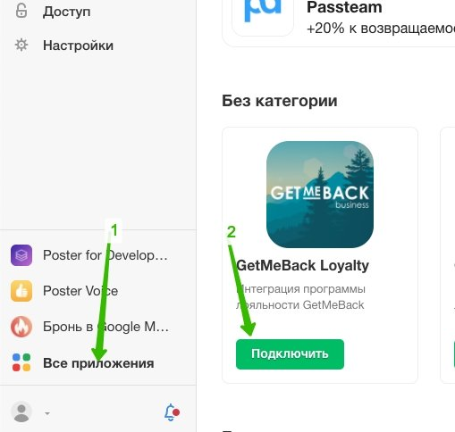
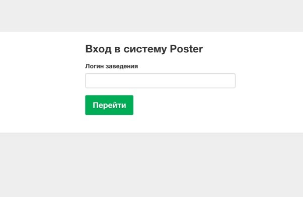
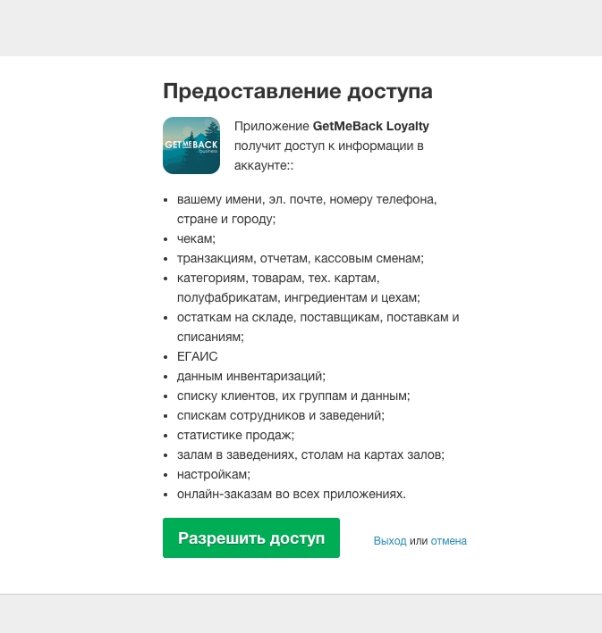
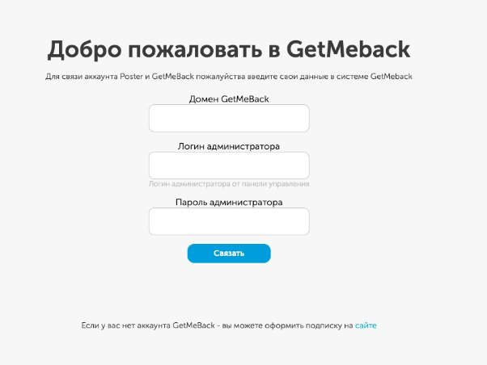

Связь аккаунтов Poster и GetMeBack

1. Зайти в личный кабинет Poster, слева в меню есть раздел “Все приложения” В нём найти приложение GetMeBack Loyalty, и нажать кнопку “Подключить”

   

2. Откроется окно, в котором Poster попросит ввести домен заведения. Иногда дополнительно в этой форме нужно ввести логин и пароль Администратора, например если мы авторизовались в личном кабинете Poster под

   пользователем без роли администратора

   

3. Нужно разрешить доступ приложению GetMeBack доступ к информации

   

4. После проверки прав администратора в Poster вас перенапривит на страницу авторизации GetMeBack. В форме нужно ввести домен заведения в системе

   GetMeBack, логин и пароль администратор.

   

5. После связки кабинетов GetMeBack и Poster можно начинать пользоваться системой. В отдельных случаях для активации интеграции на планшетах нужно заново авторизоваться на планшете, либо нажать кнопку “Очистить кеш” Для этого в правой части терминала нужно нажать на “•••” и выбрать пункт “Очистить кеш”
