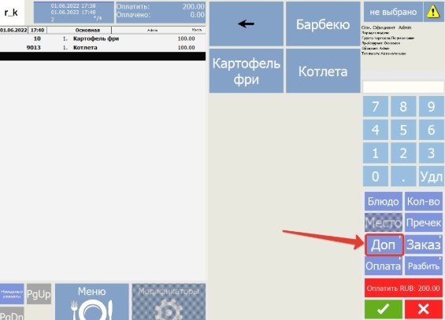
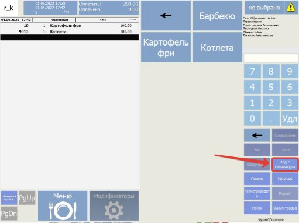
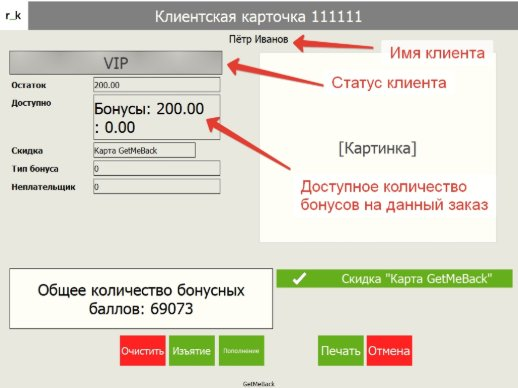
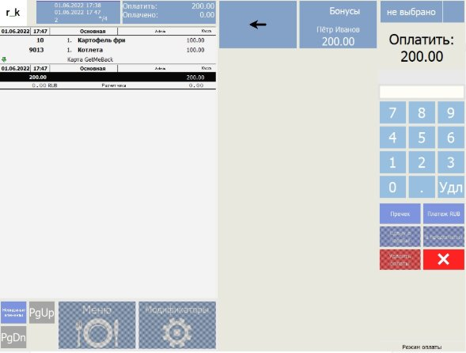
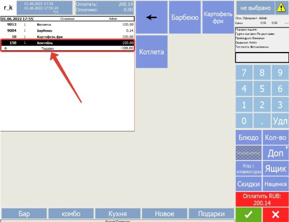

Инструкция по использованию GetMeBack\_farcards 

Редакция от 4 откября 2023 

Настоящее руководство поможет вам использовать бонусную систему GetMeBack через R\_keeper. 

Взаимодействие кассира с интеграцией 

**Данное описание предназначено для взаимодействия с клиентами у стойки.** 

Алгоритм работы с заказом: 

Для применения карты GetMeBack вводом с клавиатуры следовать инструкции Доп -> Код с клавиатуры, далее вводим идентификатор карты или промокода с подарком. 

После корректного ввода идентификатора клиента, у вас отобразится форма с информацией по данному идентификатору, а также применится лояльность GetMeBack к заказу. 

При оплате заказа у вас появится возможность списать бонусные баллы. 

При применении промокода с подарком, в заказ добавится блюдо со скидкой. Также есть возможность списать бонусные баллы. 
