Редакция №2 от 23.07.2025  

**Инструкция по настройке интеграции R\_keeper и модуля GetMeBack\_farcards**

**Оглавление** 

1. ***Поставка ................................................................................................ 2*** 
1. ***Настройка r\_keeper ............................................................................. 3*** 
1) **Интерфейс для кассового сервера ................................................ 3** 
1) **Логический интерфейс ..................................................................... 4** 
1) **Алгоритм обработки карт ................................................................ 3** 
1) **Скидка ................................................................................................. 4** 
1) **Подарок ............................................................................................... 5** 
1) **Валюта ................................................................................................ 6** 
7) **Группа меню для подарков ............................................................. 7** 
7) **Настройки макета пречека ............................................................... 8** 
3. ***Настройка GetMeBack\_farcards ....................................................... 13*** 
1) **Конфигурационный файл ............................................................. 13** 
1) **Запуск приложения ........................................................................ 13** 
4. ***Инструкция для кассира .................................................................. 15*** 
1. **Работа с быстрым чеком ............................................................. 15** 
1. **Работа с созданием заказа .......................................................... 21** 

1. **Поставка**  

ПО  поставляется  в  zip  архиве.  Установка  на  конечный  компьютер осуществляется путем распаковки архива в любую папку на жестком диске компьютера.  

Рекомендуется устанавливать модуль GetMeBack\_farcards на том же компьютере, где расположен кассовый сервер (мид).   

Поддерживаемые версии r\_keeper 7.6.4, 7.6.5 и выше 

`  `Тех. Поддержка с 8:00 до 20:00 по МСК по рабочим дням

+7 (812) 407-27-85 WhatsApp или телефон, телеграм @getmeback\_support, support@getmeback.ru

![ref1]

2. **Настройка r\_keeper**  

Настоящее руководство поможет вам подключить R\_keeper к GetMeBack. Пожалуйста следуйте инструкции, не пропускайте пункты и соблюдайте порядок действий.  

1) Интерфейс для кассового сервера  

В менеджерской станции перейдите в справочник «Сервис → Станции и Устройства».  

Выберите кассовый сервер, для которого настраивается модуль и откройте вкладку «Устройства».  

Нажмите на пустом месте правой кнопкой мыши и откройте «Список драйверов», в списке найдите «PDS interface» и перетащите его в список устройств кассового сервера.  

В настройках интерфейса в поле «PDS Server Name» укажите «GetMeBack», это же название используется в настройке GetMeBack\_farcards (FARCARDS.INI, поле NetServerName).  

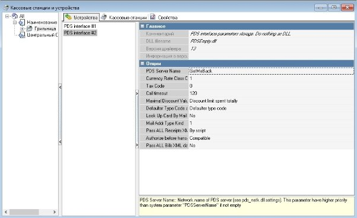

![ref1]

2) Логический интерфейс  

Перейдите в справочник «Сервис → Интерфейсы».  

На пустом месте нажмите правой кнопкой мыши и выберите «Новый интерфейс».  

В настройках интерфейса укажите название «GetMeBack» и переведите статус в «Активный».  

В разделе «Файлы библиотек (DLL)» во вкладке с названием ресторана укажите физический интерфейс из прошлого пункта для каждого кассового сервера.  

ВНИМАНИЕ. Убедитесь, что к физическому интерфейсу (PDS interface) привязан только один логический интерфейс — тот, что был создан в этом пункте, GetMeBack.  

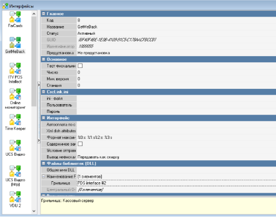

3) Алгоритм обработки карт  

Перейдите в справочник «Сервис → Обработка сигналов устройств → MCR алгоритмы».  

Создайте новый алгоритм, укажите в настройках тип алгоритма «Скрипт вер. 7.0».  

В типах устройств выберите типы «Клавиатура», «Скрипт» и «Штрих код».  

Выберите «Интерфейс» в поле «Область», в поле «Объект» выберите логический интерфейс из прошлого пункта.  

Дважды щелкните по алгоритму, чтобы открыть редактор скрипта и замените строку «Result := False;» на «Result := Length(Parameter) = 9;», затем нажмите кнопки «Проверка» и «ОК».  

![ref1]
`  `Тех. Поддержка с 8:00 до 20:00 по МСК по рабочим дням

+7 (812) 407-27-85 WhatsApp или телефон, телеграм @getmeback\_support, support@getmeback.ru

4) Скидка  

Перейдите в справочник «Деньги → Скидки и Наценки».  

Добавьте новый тип скидок и в нем создайте новую скидку «Карта GetMeBack», поменяйте тип скидки на «Процент».  

В свойствах скидки поставьте галочку на свойствах «Комб. с любой скидкой», «На заказ» и «Не вручную» Также в разделе «интерфейс» выберите «GetMeBack».  

Перейдите во вкладку «Детализации» и создайте новую детализацию с процент 100.  

После создания детализации скидку можно перевести из статуса «Черновик» в «Активный». Запомните код скидки, он понадобится в дальнейшем.  

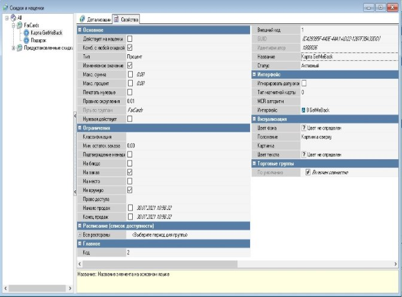

`  `Тех. Поддержка с 8:00 до 20:00 по МСК по рабочим дням

+7 (812) 407-27-85 WhatsApp или телефон, телеграм @getmeback\_support, support@getmeback.ru

![ref1]

5) Подарок  

Перейдите в справочник «Деньги → Скидки и Наценки».  

Добавьте новый тип скидок и в нем создайте новую скидку «Подарок», поменяйте тип скидки на «Процент».  

В свойствах скидки поставьте галочку на свойствах «Комб. с любой скидкой», «На блюдо» и «Не вручную» Также в разделе «интерфейс» выберите «GetMeBack».  

Перейдите во вкладку «Детализации» и создайте новую детализацию с процент 100.  

После создания детализации скидку можно перевести из статуса «Черновик» в «Активный».  

Код данной скидки необходимо ввести в параметры модуля  GetMeBack\_farcards (gift\_code)  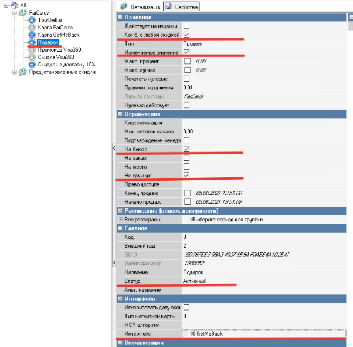

`  `Тех. Поддержка с 8:00 до 20:00 по МСК по рабочим дням

+7 (812) 407-27-85 WhatsApp или телефон, телеграм @getmeback\_support, support@getmeback.ru

![ref1]

6) Валюта  

Перейдите в справочник «Деньги → Валюты».  

В типе валют «Платежные карты» создайте новую валюту «Бонусы».  Поставьте галочки на ограничениях «Не в сдаче», «Предоплаты».  Укажите тип фискальности «Печатать скидку».  

В значении «Интерфейс» укажите логический интерфейс «GetMeBack», который был создан ранее.  

Установите значения «Макс. Процент» и «Минимальная сумма», эти значения нужно взять в личном кабинете GetMeBack в разделе Программа Лояльности, Механики – Ограничение оплаты баллами.  

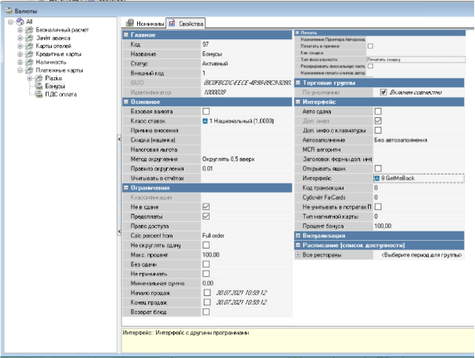

`  `Тех. Поддержка с 8:00 до 20:00 по МСК по рабочим дням

+7 (812) 407-27-85 WhatsApp или телефон, телеграм @getmeback\_support, support@getmeback.ru

7) Группа меню для подарков  

Перейдите в справочник «Меню → Меню»  

В левом сайдбаре вам необходимо нажать правой кнопкой мыши на пустое место и выбрать «Новая группа меню», назовите её «Подарки».  

Выберите новую группу меню «Подарки», затем правой кнопкой мыши в разделе «Блюда» нажмите на пустое место и выберите «Новое блюдо». Пропишите новому блюду название и в разделе «Интерфейс» добавьте логический интерфейс  

«GetMeBack». Для интеграции в «GetMeBack» используйте код блюда. 

`  `Тех. Поддержка с 8:00 до 20:00 по МСК по рабочим дням

+7 (812) 407-27-85 WhatsApp или телефон, телеграм @getmeback\_support, support@getmeback.ru

8) Настройки макета пречека 
1. Перейдите в меню: **Настройки > Печать > Использование **

**схем печати**. Узнайте схему печати, которая используется сейчас: приоритет снизу вверх — чем ниже, тем приоритетнее.  

2. Перейдите в меню: **Настройки > Печать > Схемы печати**  
2. Выберете используемую схему печати, которую узнали в 

прошлом пункте. Найдите документ **Пречек**, узнайте какой макет: **код и название** сейчас используется по умолчанию.

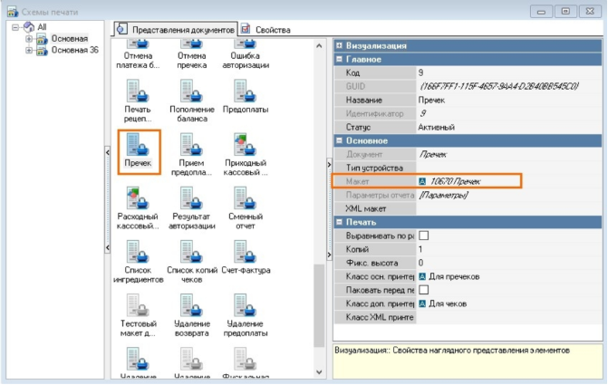

`  `Тех. Поддержка с 8:00 до 20:00 по МСК по рабочим дням

+7 (812) 407-27-85 WhatsApp или телефон, телеграм @getmeback\_support, support@getmeback.ru

![ref1]

4. Перейдите в меню **Настройки > Печать > Документы и **

**макеты**  

5. Перейдите в раздел **Расчёт с покупателем** и выберите пункт  

**Пречек**  

6. Скопируйте макет текущего пречека название и номер которого 

вы посмотрели в **Схеме печати.** Нажмите на иконку пречека правой кнопкой мышки и выберите **Копировать**, затем, на пустом месте **Вставить** 

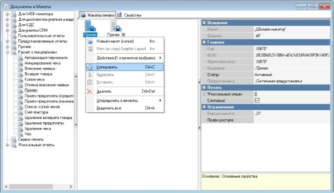

7. Перейдите в редактирование дизайна макета, нажав левой 

кнопкой на ... в поле **Макет** или нажав дважды на **[Дизайн макета]**  

8. В дизайнере макетов нажмите кнопку      или сочетание 

клавиш  

**Ctrl+O**  

9. Выберите файл макета **“Пречек GMB.mak” он находится в** 

**папке со сборкой.**  

10. Нажмите **Открыть**  
10. Новый макет импортируется.   
10. В макете необходимо выбрать мемо с надписью [data]  

`  `Тех. Поддержка с 8:00 до 20:00 по МСК по рабочим дням

+7 (812) 407-27-85 WhatsApp или телефон, телеграм @getmeback\_support, support@getmeback.ru

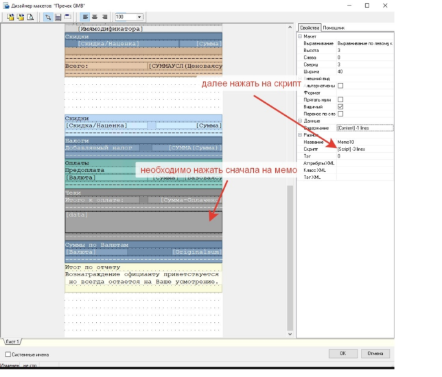

13. Далее необходимо изменить ip на тот, где будет запущен Farcard  ![ref2]![ref3]![ref4]

и указать порт, на котором будет работать сервер. Номер порта  - нужно  ![ref5]![ref3]![ref6]придумать, выбрав любой свободный. Далее значение этого порта нужно  ![ref5]будет вписать  в GetMeBack.ini , который находится в ка талоге c FarCards.  

Параметр называется "server\_port". 

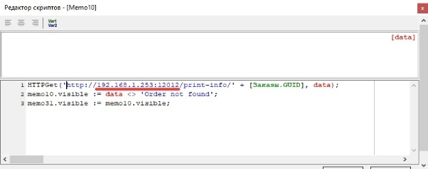

14. Сохраните изменения.  ![ref2]![ref3]![ref6]
14. Снова откройте текущую схему печати, название которой вы  ![ref2]![ref3]![ref4]

посмотрели ранее в использование схем печати, выберете текущий макет  ![ref5]пречека, посмотрите какой Класс осн. принтера выбран, стоит ли галочка  ![ref5]Паковать перед печатью, запомните это.   ![ref3]

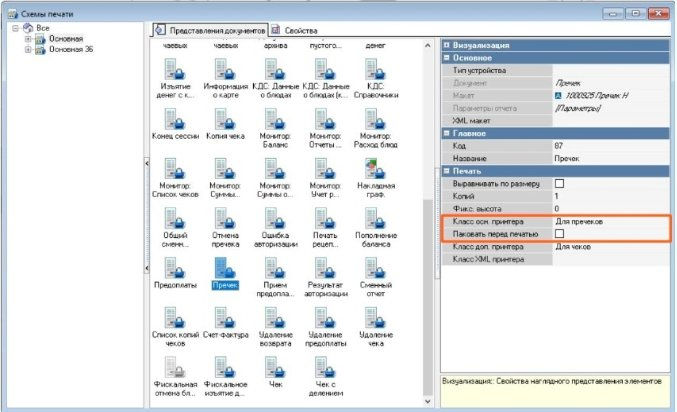

16. Добавьте созданный ранее макет **Пречек GMB**: нажмите на 

свободном месте правой кнопкой мыши, затем выберите **Добавить представление документа**  

17. Выберете раздел Расчёт с покупателем, подраздел Пречек и 

нажмите дважды на макет **Пречек GMB**.  

18. В поле Класс осн. принтера выберете тот класс осн. принтера, и то 

состояние галочки Паковать перед печатью, которые вы запомнили ранее из старого макета.  

3. **Настройка GetMeBack\_farcards**  
1) Конфигурационный файл  

Откройте файл FARCARDS.INI и установите значение параметра NetServerName в соответствии с параметром PDS Server Name, который был указан в настройке физического интерфейса.  

В файле netk.ini установите любой свободный TCP порт в параметр «port».  

Откройте файл GetMeBack.ini и отредактируйте значения в соответствии с рестораном, в котором устанавливается модуль.  

Секция [PARAMS]  

- BaseURL — адрес GetMeBack API  

https://[account].getmeback.ru/rest/base/v33/validator   

- ApiKey — токен, предоставляемый GetMeBack.  
- id\_branch — ID филиала, в котором совершена операция.  
- branch\_name — Название филиала, в котором была совершена 

операция.  

- bonus\_id — Код, который указан в разделе скидка  
- gift\_code  — Код, который указан в разделе подарок  
- server\_port — Порт сервера, который используется в разделе 

Настройки макета пречека  

Секция [LOG]  

- LogLevel — уровень логирования. От 0 (только ошибки) до 10 

(максимум подробностей).  

- OldLogs — время жизни старых Log файлов в днях.  
- LogMem — логировать ли используемую оперативную память. 
2) Запуск приложения  

ВНИМАНИЕ. После выполнения настроек необходимо перезапустить кассовый сервер и кассовую станцию r\_keeper.  

Первый запуск FarCards.exe нужно выполнить с ключом /desktop. Убедитесь, что статус GetMeBack.dll **Ok**.  

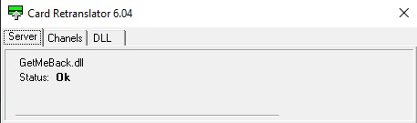

Во вкладке DLL есть строка с сетевым именем сервера и статусом Ok.  

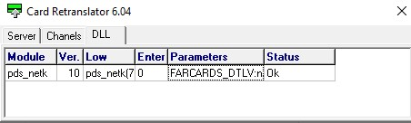

После этого запустите FarCards.exe с ключом /install и запустите в  Windows установленную службу.

4. **Инструкция для кассира**  

**Данное описание предназначено для взаимодействия кассира с клиентами GetMeBack у стойки.**  

1. Работа с быстрым чеком  
1) Открываем форму «Быстрый чек»  

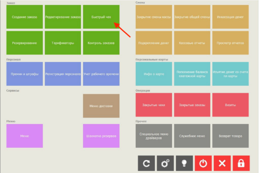

2) Добавляем товары в заказ, нажимаем на кнопку «Код с клавиатуры» 

и вводим номер карты лояльности или промокод с подарком(если моб. приложение).  

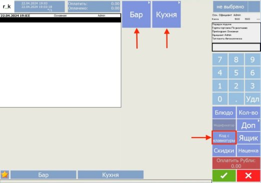

3) Вводим номер с карты лояльности клиента или сканируем QR-код.  

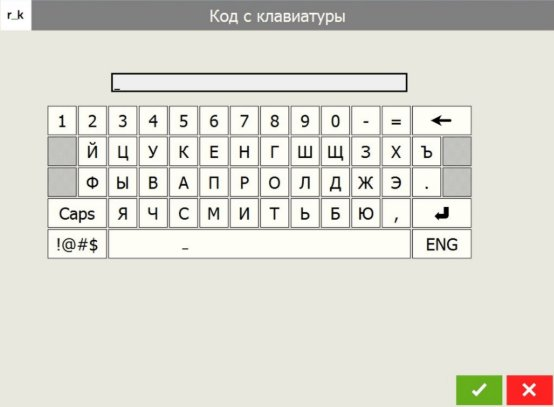

4) После корректного ввода, откроется карточка клиента, где можно 

посмотреть информацию о доступных бонусах. Чтобы списать или начислить баллы, нажимаем на поле с надписью «Картинка».  

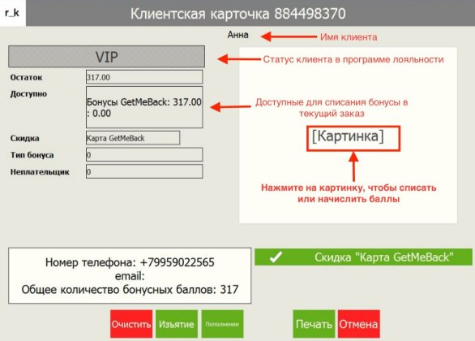

5) Переходим в раздел для оплаты, нажав на кнопку «Оплатить рубли»  

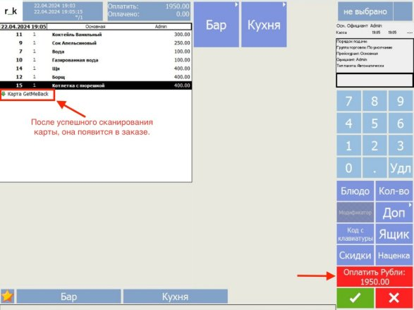

6) При накоплении бонусов, проводим оплату без дополнительных 

действий, закрываем заказ. При списании нажимаем на «Платежные карты»

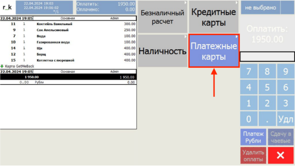

7) В окне с бонусами указываем количество бонусов для списания и 

нажимаем на «Бонусы GetMeBack». 

8) После успешного списания, изменится баланс бонусов и на форме с 

товарами появится информация об оплате баллами. Оставшуюся сумму нужно оплатить наличными или картой.  

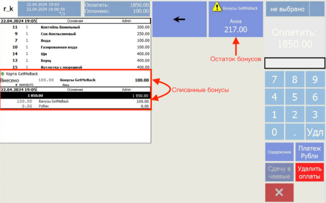

9) После завершения оплаты, в GetMeBack поступит информация о 

составе чека с информацией о бонусах, а также продавце и клиенте. 

![ref7]

2. Работа с созданием заказа  
1) Открываем создание заказа  

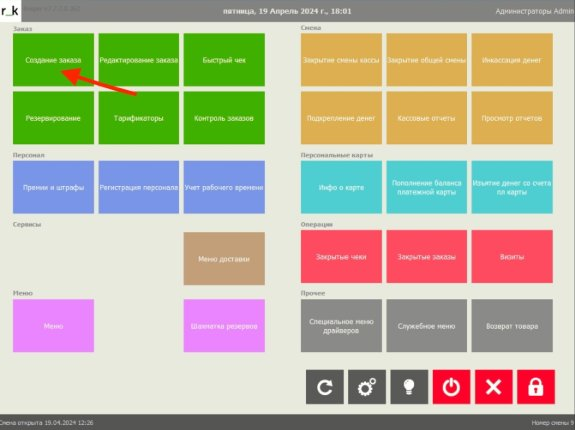

2) Указываем количество гостей и выбираем стол.  

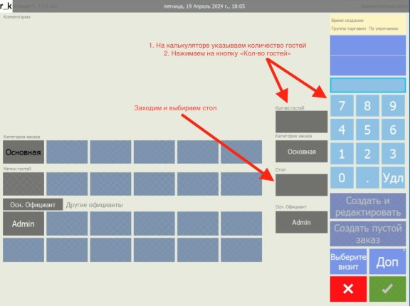

3) Открываем один из доступных столов  

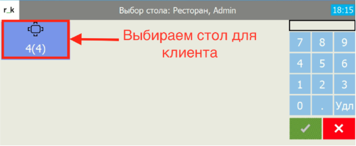

4) Добавляем товары в заказ  

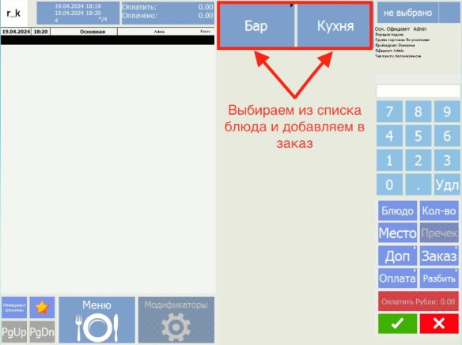

5) После добавления товаров заходим в «Доп»  

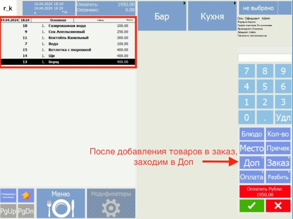

6) Нажимаем на кнопку «Код с клавиатуры», сканируем карту лояльности 

или вводим код вручную на клавиатуре.  

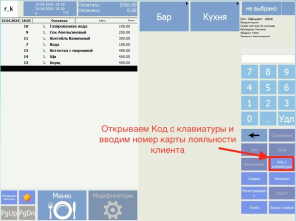

7) После корректного ввода, откроется карточка клиента, где можно 

посмотреть информацию о доступных бонусах. Чтобы списать или начислить баллы, нажимаем на поле с надписью «Картинка»  

`  `Тех. Поддержка с 8:00 до 20:00 по МСК по рабочим дням

+7 (812) 407-27-85 WhatsApp или телефон, телеграм @getmeback\_support, support@getmeback.ru

![ref1]

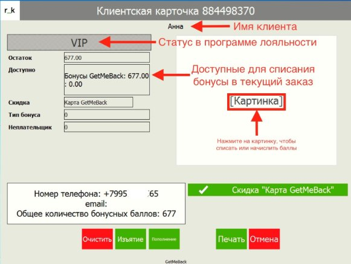

8) Проверяем информацию в заказе и печатаем клиенту пречек.  

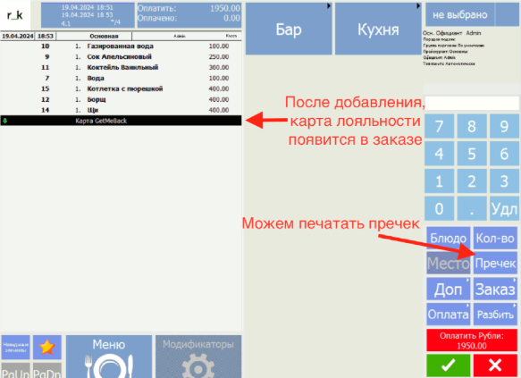

9) Пречек к заказу выглядит слеТедх.уПюоддщерижкма с  о8:0б0 рдоа2з0:о00мпо  МСК по рабочим дням

+7 (812) 407-27-85 WhatsApp или телефон, телеграм @getmeback\_support, support@getmeback.ru

![ref1]

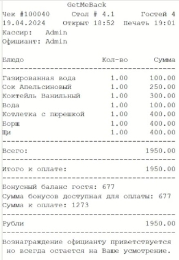

10) Переходим в раздел для оплаты, нажав на кнопку «Оплатить рубли»  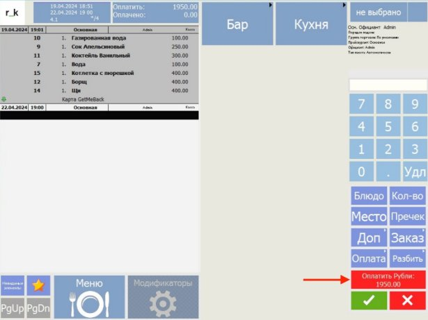
11) Клиент копит бонусы, проводим оплату по карте или наличными. Если 

нужно списать бонусы, то нажимаем на «Платежные карты»

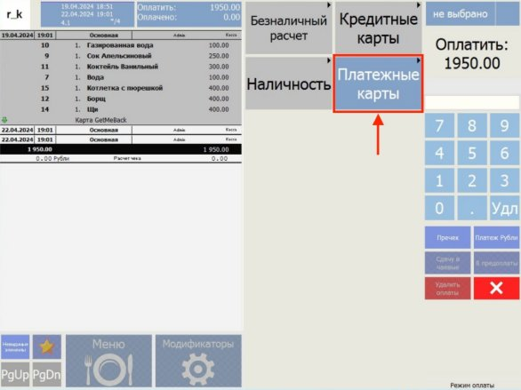

12) В окне с бонусами указываем количество бонусов для списания и 

нажимаем на «Бонусы GetMeBack».  

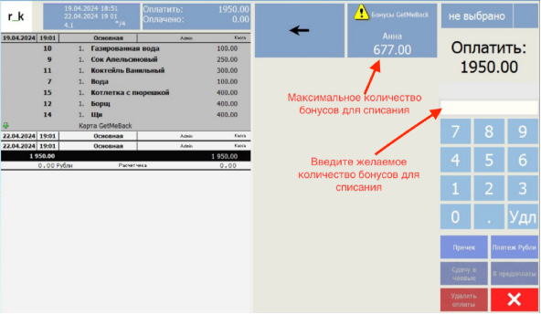

13) После успешного списания, изменится баланс бонусов и на форме с 

товарами появится информация об оплате баллами. Оставшуюся сумму нужно оплатить наличными или картой.  

14) После завершения оплаты, в GetMeBack поступит информация о 

составе чека с информацией о бонусах, а также продавце и клиенте. 

![ref8]
`  `Тех. Поддержка с 8:00 до 20:00 по МСК по рабочим дням

+7 (812) 407-27-85 WhatsApp или телефон, телеграм @getmeback\_support, support@getmeback.ru

![ref1]

[ref1]: Aspose.Words.e24bea32-7cbc-4c91-84cf-51b1105a2602.001.png
[ref2]: Aspose.Words.e24bea32-7cbc-4c91-84cf-51b1105a2602.017.png
[ref3]: Aspose.Words.e24bea32-7cbc-4c91-84cf-51b1105a2602.018.png
[ref4]: Aspose.Words.e24bea32-7cbc-4c91-84cf-51b1105a2602.019.png
[ref5]: Aspose.Words.e24bea32-7cbc-4c91-84cf-51b1105a2602.020.png
[ref6]: Aspose.Words.e24bea32-7cbc-4c91-84cf-51b1105a2602.021.png
[ref7]: Aspose.Words.e24bea32-7cbc-4c91-84cf-51b1105a2602.043.jpeg
[ref8]: Aspose.Words.e24bea32-7cbc-4c91-84cf-51b1105a2602.057.jpeg
